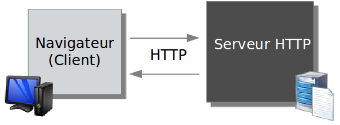
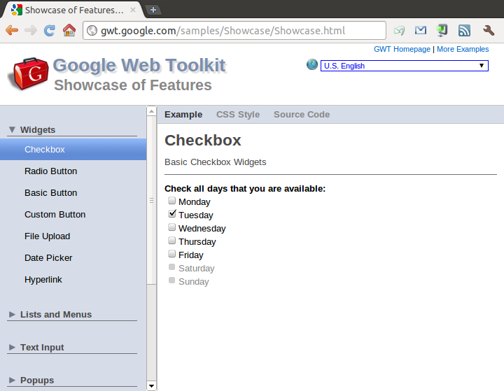

# Introduction

<!-- .slide: class="page-title" -->


Notes :


## World Wide Web et HTML

- HTML a été créé en 1991 par Tim Berners-Lee
	- « Web » lié historiquement à la notion d'hypertexte
	- HTML = Hypertext Markup Language

- <sub>Plusieurs versions se sont succédées (aujourd'hui HTML5)</sub>
	- Ajout des images
	- Ajout des formulaires
	- Vidéo, audio

Notes :


## World Wide Web et HTML

- S'oppose au modèle client-serveur dominant à l'époque
	- Absence de déploiement coté client
	- Portabilité (navigateur web → "client universel")
Notes :


## Rappels sur le Web 1.0

- Mode requête / réponse synchrone
- Mise à jour complète de l'IHM à chaque "action utilisateur"
- Technologies coté client : HTML / DHTML / CSS
- Pas de logique de traitement côté client


Notes :


## Le monde JEE - Servlets & JSP

- Servlets
	- Les Servlets ont supplanté l'utilisation de script CGI
	- Composant de base de la plateforme JEE
		<figure style="display: block; float: left; margin: 15px 0; width: 100%"> Le conteneur de Servlet n'a besoin que d'une instance de chaque Servlet et peut ensuite les « multi-threader »</figure> 
		<figure style="display: block; float: left; margin: 15px 0; width: 100%">	
     Écriture de la réponse via des println()
</figure> 


## Le monde JEE - Servlets & JSP

- JSP
	- Possibilité de « mixer » du code HTML avec du code Java
	- Plus de println() → on écrit directement du HTML et les parties dynamiques en Java.
- Ne résout pas les problèmes de maintenance → cohabitation de code applicatif et de logique d'affichage
Notes :


## Modèle MVC

- Création de frameworks découplant le code applicatif du rendu graphique
	- Struts, WebWork …
- Implémentation du pattern MVC (Modèle-Vue-Contrôleur)
	- Possibilité de mieux factoriser/réutiliser le code applicatif
	- Néanmoins la vue reste « jetable »
- La factorisation de la vue n'est possible que dans certains types de frameworks (ie. Component-Based)
	- JSF, Wicket
Notes :


## Web 2.0

- Le terme « Web 2.0 » désigne deux concepts
	- Concept social : impliquer les internautes dans le contenu
	- Concept technique : AJAX
- AJAX : Asynchronous Javascript And XML
	- Récupération de données sous forme de fragments XML
	- Mise à jour de la vue directement pilotée en Javascript dans le navigateur
Notes :


## AJAX et l'asynchronisme

- Originellement créé par Microsoft avec la fonction XMLHTTPRequest
	- Envoi de requêtes non bloquantes
	- Affichage de contenu dynamique
	- Limitation d'envoi de données inutiles
	- Plus d'effet « page blanche » ou de formulaires effacés
	- Meilleure UX : interactivité et réactivité de la part de l'application

<figure style="display: block; float: left; margin: 30px 0; width: 40%">
    
</figure>

Notes :


## AJAX

- AJAX est une technologie coûteuse
- Difficile à écrire
	- Runtimes et comportements différents selon les navigateurs
	- Pas de type-checking
	- Support de Javascript très variable selon les IDE
- Difficile à débugger
	- Peu de debuggers : Venkman de Mozilla, Microsoft Script Debugger/Editor
	- Pas d'intégration à l'IDE facile
Notes :


## Frameworks AJAX

- Plusieurs types de frameworks AJAX
	- Simplification du développement JavaScript : Dojo, JQuery ...
	- Simplification des appels client-serveur : DWR ...
	- « X-Windows » pour le Web : XML11, Echo2 …
- Le cœur des frameworks AJAX reste le langage Javascript
- GWT est très différent → on ne développe plus en Javascript mais en Java
Notes :


## GWT en bref

- GWT permet de mettre en œuvre des applications standards
	- HTML / Javascript / CSS
- GWT permet de nous abstraire des contraintes web
	- Standards non respectés
	- Complexité du développement Javascript
	- Fuite mémoire Javascript
Notes :


## GWT en bref

- Comment ?
	- Un compilateur Java vers Javascript
	- Un ensemble de widgets prêts à l'emploi
	- Un mécanisme de RPC (Remote Procedure Call)
	- Un environnement de test et de debug entièrement en Java
Notes :


## Exemple d'application GWT

```java
package com.zenika.resanet.gwt.client;
…
public class Resanet implements EntryPoint {

	public void onModuleLoad() {
		Label label = new Label("ACCUEIL");
		label.setHeight("50px");
		RootPanel.get().add(label);
 
		Button button = new Button("Cliquez");
		button.addClickHandler(new ClickHandler() {
 
			@Override
			public void onClick(ClickEvent event) {
				Window.alert("Bonjour tout le monde !");
			} 
		});

		RootPanel.get().add(button);
	}
}
```

<figure style="position: absolute; bottom: 35%; right: 0;">
    
</figure>
Notes :


## Application GWT


Notes :


## Compilation (1/3)

- GWT permet d'écrire l'interface graphique d'une application web en Java, puis de la compiler vers du HTML et du JavaScript
- Permet de n'utiliser qu'un seul langage de programmation (ie. Java)
	- Populaire et extrêmement répandu dans le monde de l'entreprise
	- Fortement outillé (Eclipse, Intellij …)
- Ainsi, GWT, avec son approche « Java », nous offre la possibilité de débugger 
«&nbsp;comme d'habitude&nbsp;»
Notes :


## Compilation (2/3)

- Permet de compiler automatiquement vers plusieurs cibles, correspondant à tous les OS et navigateurs du marché, de façon totalement transparente
- Rend possible des optimisations à la compilation du code généré
	- Suppression du code non appelé
	- « Tuning » et compression du code restant
- Les mécanismes RPC évitent les conversions Objet Java / chaîne de caractère (ou XML)
Notes :


## Compilation (3/3)


Notes :


## Limitations (1/3)

- GWT n'est pas adapté dans un contexte où vous avez une équipe de designers et une équipe de développeurs
- Le compilateur ne travaille que sur un sous-ensemble de la runtime Java (rt.jar)
	- La quasi totalité du package java.lang (String, Integer …)
	- Une partie du package java.util (List ...)
	- En pratique pas gênant
		- les packages pris en charge par GWT répondent à 99% des besoins
		- il est possible d'enrichir l'émulation Java/Javascript
Notes :


## Limitations (2/3)

- Aucun widget de haut niveau n'est fourni
	- Google a pensé ses APIs pour l'extensibilité et la redéfinition
	- Il a toujours été possible et encouragé de créer ses widgets
	- Du fait des APIs stables, il n'y a eu historiquement quasi aucun changement suite à une montée de version

Notes :


## Limitations (3/3)

- Aucun mécanisme n'est prévu pour l'indexation du site
	- Il est plus compliqué de concilier site à vocation commerciale et GWT puisque les robots de moteurs de recherche n'exécutent pas le JavaScript : GWT permet de développer des applications web, non des sites web
	- Ne pas tenter de servir un contenu spécifique aux robots car sinon le site concerné sera automatiquement retiré des classements (ie. comportement de Google)
Notes :


## Installer GWT

- GWT se compose uniquement d'un fichier Zip
- GWT est téléchargeable sur un site dédié
	- http://www.gwtproject.org/download.html
- Chacune des distributions GWT contient
	- Bibliothèques GWT
	- Documentation
	- Javadoc
	- Applications d'exemple
Notes :


## Historique GWT

- Première release de GWT livrée en juin 2006
- De nouvelles releases sont publiées régulièrement par GWT
	- Chacune des releases apporte son lot de nouveautés
		- Enrichissement de l'émulation Java/Javascript
		- Concepts (Code Splitting, UIBinder ...)
		- Outillage (Plugin Eclipse, rapport de compilation ...)
	- Depuis la naissance de GWT, aucune « cassure » de la compatibilité ascendante n'est à noter
- Version actuelle : 2.7
- Site :http://gwtproject.org/
Notes :


## Présentation de Showcase

- Showcase est l'application de démonstration officielle des Widgets
	- Présente tous les Widgets triés par type
	- Située dans <ROOT_GWT\>/samples/Showcase
- Importer dans Eclipse
	- Génération des fichiers.classpathet.projectvia la commande Ant : ```ant eclipse.generate```
	- Lancer le mode développement via la commande Ant : ``` ant devmode ```
- Showcase est disponible en ligne
	- http://samples.gwtproject.org/samples/Showcase/Showcase.html
Notes :


## Showcase

<figure>
    
</figure>

Notes :


<!-- .slide: class="page-questions" -->


<!-- .slide: class="page-tp1" -->
