# Création d'un projet GWT sous Eclipse

<!-- .slide: class="page-title" -->


Notes :


## Plugin Eclipse

- Google fournit un plugin Eclipsepermettant
	- De créer un projet GWT sous Eclipse
	- De lancer une application GWT enmode « Développement »
	- De compiler une application GWT
- Installation du plugin sous Eclipse
	- Sous Eclipse : menu Help > Install New Software...
	- Ajouter l'adresse du plugin :http://dl.google.com/eclipse/plugin/<version_eclipse>(exemple : 3.7)
	- Sélectionner le plugin
	- Lancer l'installation


Notes :


## Créer un projet via le plugin GWT


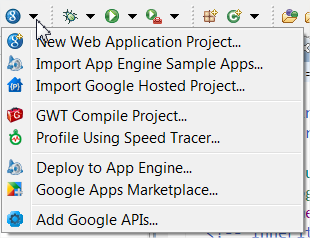


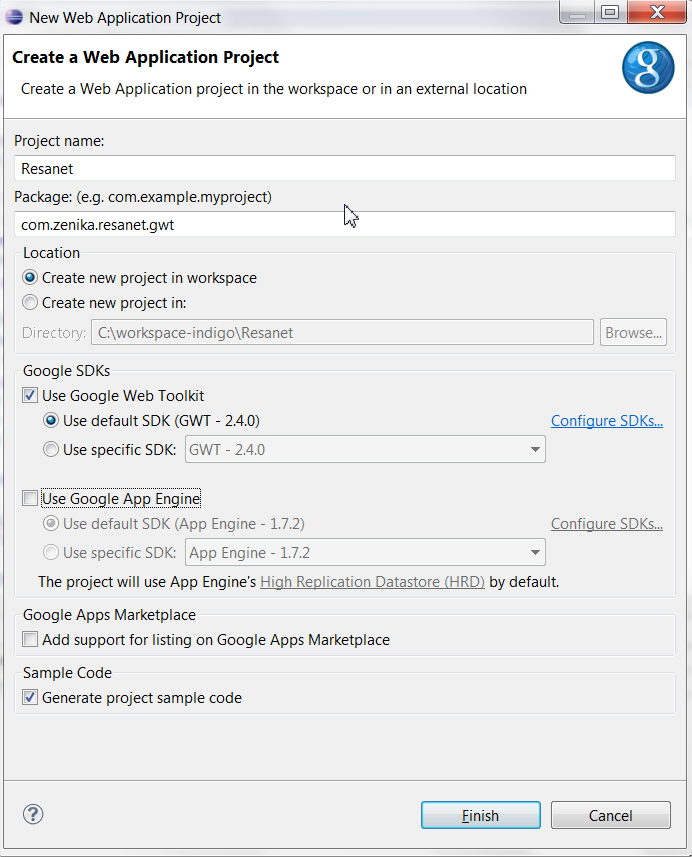

Notes :


## WebAppCreator

- La distribution de Google fournit plusieurs fichiers de commande utiles pour la création de projets GWT pouvant servir d'alternatives au plugin Eclipse GWT
- WebAppCreator: commande unique permettant de créer le projet GWT et le projet Eclipse
- WebAppCreatorcrée la même structure de projet que le plugin
- Il génère également un script Ant lié (exécution / compilation) à l'application GWT
Notes :


## Organisation du projet sous Eclipse


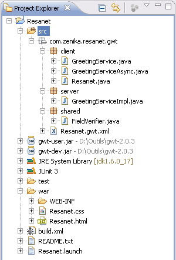
Dossier sourceDossier war
Notes :


## Structure d'un Module GWT

- Module GWT = bibliothèque GWT
	- Un répertoire « src » qui contient les sources
	- Un répertoire « war » qui contient les fichiers générés
- La structure se veut proche de celle d'une application JEE standard
	- Ressources statiques (ie. CSS, images, Javascript ...) présentes dans le dossier war
	- Présence des dossiers WEB-INF et WEB-INF/lib
	- Servlets déclarées dans le fichier web.xml
Notes :


## Module GWT (1/2)

- Répertoire client
	- Code Java transforméen Javascript à lacompilation GWT
- Répertoire server
	- Code JEE déployé surle serveur
- Répertoire shared
	- Code commun au clientet au serveur


```

```

```

```

```

```

Notes :


## Module GWT (2/2)

- Les éléments structurants d'un module GWT
	- Fichier de configuration du module
	- EntryPoint : Classe principale de l'application GWT
	- Host HTML Page : page d'accueil de l'application GWT
	- Le dossier war contient tous les éléments web de l'application : CSS, HTML, JavaScript, images


```

```


Notes :


## Le fichier de configuration XML (1/2)

- Il contient toute la configuration du module GWT
	- Module(s) duquel il hérite (équivalent import Java)
	- EntryPoint(s)
	- Répertoire(s) de la partie cliente
	- Propriétés (spécification de la locale, etc...)
- Un module peut hériter de plusieurs modules, contenir plusieurs EntryPoints et Host HTML Page<modulerename-to="resanet"><inheritsname='com.google.gwt.user.User'/><inheritsname='com.zenika.widget.DatePickerModule'/><entry-pointclass='com.zenika.resanet.gwt.client.Resanet'/><extend-propertyname="locale"values="en, fr"/><sourcepath="client"></source><sourcepath="modele"></source></module>Déclaration facultative des packages clients (par défaut "client")
Notes :


## Le fichier de configuration XML (2/2)

- Les autres tags
	- Dossier(s) public(s) : <public path="path"/>
	- JavaScript : <script src="js-url">script de test d'injection</script>
	- CSS : <stylesheet src="css-url"/>
- Remarque sur la déclaration des packages clients
	- Le package du module est considéré comme le package racine
	- Pour inclure un package ne se situant pas dans un niveau inférieur au package racine, il vous faut déclarer un nouveau module fictif et ensuite en hériter

```
Module : com.zenika.resanet.gwt.Resanet

...
<inheritsname='com.zenika.resanet.modele.ModeleObjet'/>
...
```

```
Module(fictif) : com.zenika.resanet.modele.ModeleObjet
<module>
<sourcepath=""></source>
</module>
```

```

```
Racine

```

```
Package client à inclure
Notes :


## L'interface EntryPoint

- L'interface EntryPoint contient une méthode uniqueonModuleLoad()qui est invoquée au chargement du module
- S'il y a plusieurs EntryPoints déclarés dans un module, alors ils sont tous invoqués, dans l'ordre de déclaration dans le fichier XML


Notes :


## La Host HTML Page

- La Host HTML Page est ledéclencheur duchargement du module

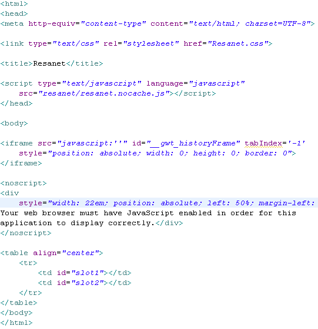
<nomDuModule>.nocache.jsSélectionne une permutation et déclenche le chargement du moduleLes iframes qui permettent à GWT d'intégrer des pages HTML contenant du code javascriptLes « slots » avec des identifiants définis par le développeur
Notes :


## Mode Développement

- Caractéristiques
	- Exécution adaptée à la phase de développement
	- Indispensable dans le développement d'applications GWT
- Avantages
	- Écriture, refactoring et débugging avec l'IDE Eclipse
	- Améliore fortement la productivité
Notes :


## Mode « Développement » (1/4)

- Le mode « Développement » est possible via l'installation d'un plugin dans le navigateur
- Une fois le plugin installé, l'utilisateur peut tester l'applicationdirectement sur le navigateur de son choix.
- Avantages
	- Liberté de tester sur le navigateur de son choix
	- Rend possible l'utilisation d'outils tels que Firebug/DeveloperTools
	- Debugging multi-navigateurs sur la même session de debugging
Notes :


## Mode « Développement » (2/4)

- Le mode « Développement » est constitué
	- D'une application Swing appelée le shell
	- D'un serveur Jetty embarqué
	- D'un plugin à installer sur le navigateur de son choix
- Mode « Développement » → Full Java
	- com.google.gwt.dev.DevMode instancie un shell
	- Le chargement du Module est exécuté en Java
	- La partie cliente du Module est exécutée en Java
Notes :


## Mode « Développement » (3/4)

- Le Shell
	- Pilote à distance le navigateur en communiquant avec le plugin
	- Affiche les erreurs de compilation, les runtime exceptions et les erreurs internes dans une console
- L'application GWT exécute le byte code Java et communique par socket avec le plugin
- Le plugin a principalement 2 rôles
	- Pilote le navigateur en interagissant avec le moteur javascript du navigateur
	- Reçoit les événements de l'utilisateur et communique avec l'application à distance
- Finalement en mode « développement », le navigateur n'a qu'un rôle d'affichage
Notes :


## Mode « Développement » (4/4)


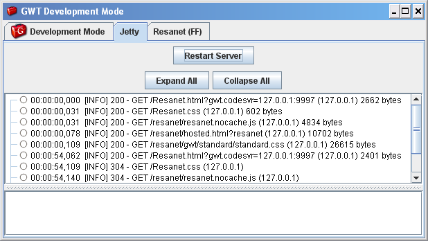
Shell

```
Processus Java
```

```
Canal
Browser
```

```
Canal
Browser
```

```
Instance
Module
GWT
```

```
Instance
Module
GWT
```

```
Browser #1
```

```
Moteur
Javascript
```

```
Plugin
Browser
```

```
Browser #2
```

```
Moteur
Javascript
```

```
Plugin
Browser
```

```

```

```

```
Socket TCP


Notes :


## Cinématique de chargement d'une Host HTML Page


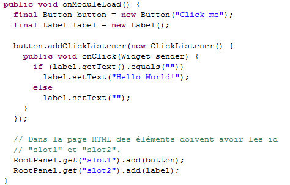
Insertion des widgets GWT au niveaudes slots de la page1affichage de la page dans le navigateur

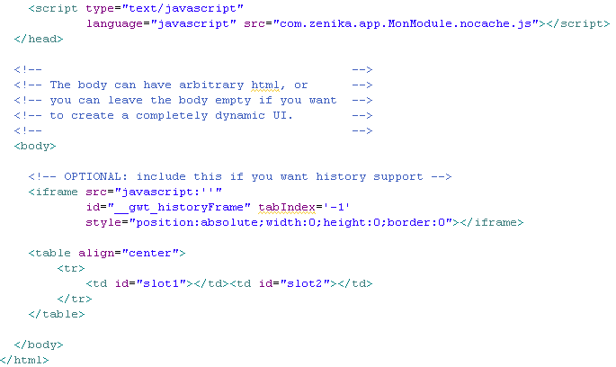
Chargement du module23Modification du rendu dans le navigateur

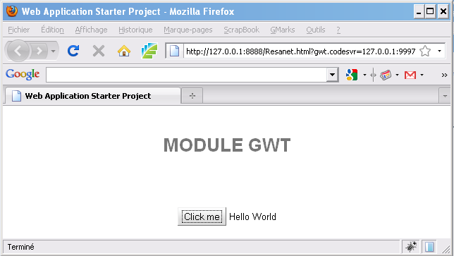
4
Notes :


## Exécution en mode « Développement »


Remarque : le plugin Eclipse lance directement le shell dans un ongletSi le shell est lancé via Ant ou une ligne de commande, celui-ci s'exécute dans une fenêtre dédiée
Notes :


## Déboguer l'application GWT


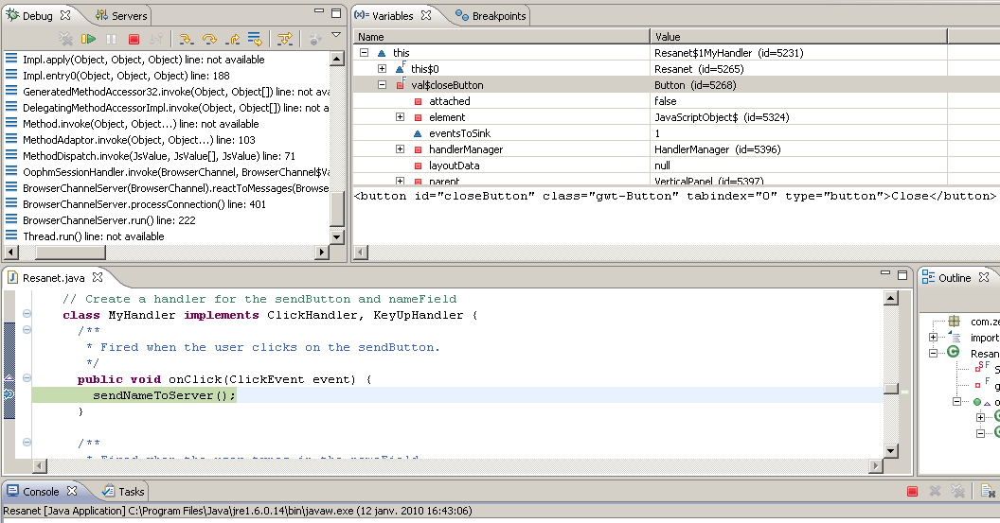


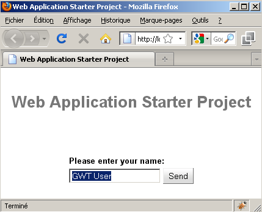
Visualisation de la variable bouton de GWTAvatar HTML du Button GWT
Notes :


## Mode Production (1/2)

- Caractéristiques
	- Exécution adaptée aux phases de qualification, recette et au-delà
- Avantages
	- Rapidité d'exécution
- Inconvénients
	- Difficile, voir impossible de débugger, corriger la partie cliente (retour au mode « Développement » nécessaire)
	- Compilation relativement longue
	- Comportement possiblement différent du mode Développement
Notes :


## Mode Production (2/2)

- Web Mode ↔ javascript : le browser est indépendant
	- Le browser est lancé par l'utilisateur
	- Le chargement du Module est exécuté en Javascript
	- La partie cliente du Module est exécutée en Javascript

```

```

```

```
Browser

```

```
Host HTML Page

```
Module partie cliente
+GWT Core Client
(fichiers .html)
```

```

```
Serveur d'application externe

```
Module partie server
```

```
GWT Core Server(gwt-user.jar)
```

```
Event DOM
```

```
DOM
```

```
RPC
```
JVMRemarque: la partie serveur n'est présente que si le site a un contenu dynamique, sinon un simple serveur HTTP comme Apache suffit
Notes :


## Compiler une application GWT
Pour un projet créé avec le plug-in Google pour Eclipse→Cliquez sur le boutondans la barre d'outilsPour un projet créé avec l'utilitairewebAppCreator :→Lancer la commande : ant build

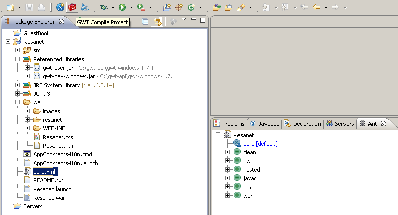


Notes :


## La Compilation/Génération

```
Module partie cliente
(package com.*.module.client)
```

```
Core GWT partie cliente
(gwt-user.jar)
```

```
Sous-ensemble de la runtime Java
(rt.jar)
```

```

```
Compilation GWT(gwt-dev.jar)

```

```

```

```
Code Javascript dédiéFirefox

```

```
Code Javascript dédiéIEOpera


Remarque: le code JavaScript n'est pas généré dans des fichiers .JS mais dans des fichiers .HTML afin de pallier des problèmes d'encodage (protocole HTTP)

```
Comportement équivalent
```

```
Fichiers *.java/ *.class
```

```
Fichiers .html
```

Notes :


## Le répertoire compilé war

- La compilateur crée un sous-répertoire portant le nom du module dans le répertoire war

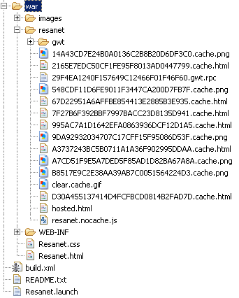

```

```

```

```
Permutations GWT (ie. un fichier HTML par type de navigateur)Fichiers communs à toutes les applications GWT
Notes :


## gwt-*.jar

- gwt-dev.jaretgwt-user.jarne sont pas destiné à être packagé dans le war.
- Seulgwt-servlet.jarest nécessaire, et ce, seulement si vous utilisez la communication RPC.
- Vous remarquerez d'ailleurs que gwt-servlet.jar ne contient aucune des classes de l'API servlet
	- gwt-dev.jarcontient le compilateur et d'autres outils comme SOYC. Vous n'en n'aurez jamais besoin pour que votre code compile.
	- gwt-user.jarcontient le framework GWT qui sera transcrit en javascript. Vous n'en aurez besoin qu'en mode development.
	- gwt-servlet.jarcontient le code nécessaire pour la partie serveur si vous utilisez le mécanisme RPC. C'est le seul jar qui doit être présent dans votre war.
Notes :


## TP 1

Notes :


<!-- .slide: class="page-questions" -->


<!-- .slide: class="page-tp1" -->