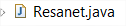
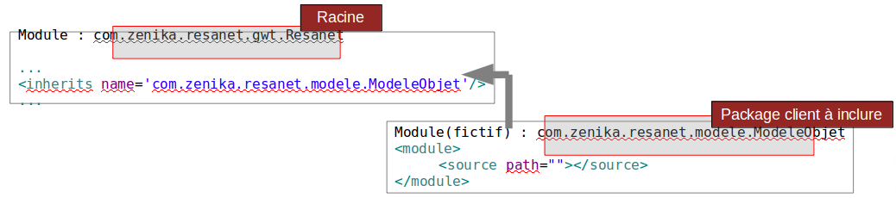

# Création d'un projet GWT sous Eclipse

<!-- .slide: class="page-title" -->

Notes :

## Plugin Eclipse (1/2)

- Google fournit un plugin Eclipsepermettant
	- De créer un projet GWT sous Eclipse
	- De lancer une application GWT en mode « Développement »
	- De compiler une application GWT

Notes :

## Plugin Eclipse (2/2)

- Installation du plugin sous Eclipse
	- Sous Eclipse : menu Help > Install New Software...
	- Ajouter l'adresse du plugin :http://dl.google.com/eclipse/plugin/<version_eclipse>(exemple : 3.7)
	- Sélectionner le plugin
	- Lancer l'installation

<figure style="position: absolute; bottom: 30px; right: 5px;">
   		
</figure>	

## Créer un projet via le plugin GWT

<figure >
   		
</figure>

Notes :

## WebAppCreator

- La distribution de Google fournit plusieurs fichiers de commande utiles pour la création de projets GWT pouvant servir d'alternatives au plugin Eclipse GWT
- WebAppCreator: commande unique permettant de créer le projet GWT et le projet Eclipse
- WebAppCreatorcrée la même structure de projet que le plugin
- Il génère également un script Ant lié (exécution / compilation) à l'application GWT
- Il donne aussi la possibilité de générer un projet Maven
Notes :

## Organisation du projet sous Eclipse

Notes :

## Structure d'un Module GWT

- Module GWT = bibliothèque GWT
	- Un répertoire « src » qui contient les sources
	- Un répertoire « war » qui contient les fichiers générés
- La structure se veut proche de celle d'une application JEE standard
	- Ressources statiques (ie. CSS, images, Javascript ...) présentes dans le dossier war
	- Présence des dossiers WEB-INF et WEB-INF/lib
	- Servlets déclarées dans le fichier web.xml

Notes :

## Module GWT (1/2)

- Répertoire client
	- Code Java transformé en Javascript à la compilation GWT
- Répertoire server
	- Code JEE déployé surle serveur
- Répertoire shared
	- Code commun au client et au serveur

<figure style="position: absolute; bottom: 10px; right: 0;">
    
</figure>

Notes :

## Module GWT (2/2)

- Les éléments structurants d'un module GWT
	- Fichier de configuration du module
	
	- EntryPoint : Classe principale de l'application GWT
		
	- Host HTML Page : page d'accueil de l'application GWT
	
	- Le dossier war contient tous les éléments web de l'application : CSS, HTML, JavaScript, images

Notes :

## Le fichier de configuration XML (1/4)

Notes :

## Le fichier de configuration XML (2/4)

- Il contient toute la configuration du module GWT
	- Module(s) duquel il hérite (équivalent import Java)
	- EntryPoint(s)
	- Répertoire(s) de la partie cliente
	- Propriétés (spécification de la locale, etc...)
- Un module peut hériter de plusieurs modules, contenir plusieurs EntryPoints et Host HTML Page

Notes :
	Déclaration facultative des packages clients (par défaut "client")

## Le fichier de configuration XML (3/4)

- Les autres tags
	- Dossier(s) public(s) : <public path="path"/>
		- JavaScript : `<script src="js-url">script de test d'injection<script>`
		- CSS : `<stylesheet src="css-url"/>`

## Le fichier de configuration XML (4/4)

- Remarque sur la déclaration des packages clients
	- Le package du module est considéré comme le package racine
	- Pour inclure un package ne se situant pas dans un niveau inférieur au package racine, il vous faut déclarer un nouveau module fictif et ensuite en hériter

Notes :

## L'interface EntryPoint

- L'interface EntryPoint contient une méthode uniqueonModuleLoad()qui est invoquée au chargement du module
- S'il y a plusieurs EntryPoints déclarés dans un module, alors ils sont tous invoqués, dans l'ordre de déclaration dans le fichier XML

<figure>
    
    <figcaption>Le logo Zenika</figcaption>
</figure>

Notes :

## La Host HTML Page (1/2)

- La Host HTML Page est le déclencheur duchargement du module

<figure>
    
</figure>

Notes :

## La Host HTML Page (2/2)

- `<nomDuModule>.nocache.js `Sélectionne une permutation et déclenche le chargement du module

- Les iframes qui permettent à GWT d'intégrer des pages HTML contenant du code javascript

- Les « slots » avec des identifiants définis par le développeur

Notes : 

## Mode Développement (1/5)

- Le mode « Développement » est possible via l'installation d'un plugin dans le navigateur

- Une fois le plugin installé, l'utilisateur peut tester l'application  directement sur le navigateur de son choix.

- Avantages
	- Liberté de tester sur le navigateur de son choix
	- Rend possible l'utilisation d'outils tels que Firebug/DeveloperTools
	- Debugging multi-navigateurs sur la même session de debugging

Notes : 

## Mode Développement (2/5)

- Le mode « Développement » est constitué
	- D'une application Swing appelée le shell
	- D'un serveur Jetty embarqué
	- D'un plugin à installer sur le navigateur de son choix

- Mode « Développement » → Full Java
	- com.google.gwt.dev.DevMode instancie un shell
	- Le chargement du Module est exécuté en Java
	- La partie cliente du Module est exécutée en Java

Notes : 

## Mode Développement (3/5)

- Le Shell
	- Pilote à distance le navigateur en communiquant avec le plugin
	- Affiche les erreurs de compilation, les runtime exceptions et les erreurs internes dans une console

- L'application GWT exécute le byte code Java et communique par socket avec le plugin

- Le plugin a principalement 2 rôles
	- Pilote le navigateur en interagissant avec son moteur javascript
	- Reçoit les événements de l'utilisateur et communique avec l'application à distance

- Finalement, le navigateur n'a qu'un rôle d'affichage

Notes : 

## Mode Développement (4/5)

Notes : 

## Mode Développement (5/5)

- Instable à cause des fuites mémoires
- Lent

- En cours d'abandon
	- Suppression en cours des API des navigateurs pour raison de sécurité
		- API supprimée depuis Firefox 27

Notes :

## Mode Super developpement

- Caractéristiques
	- Exécution adaptée à la phase de Développement
	- Indispensable dans le développement d'application GWT

- Avantages 
	- Ecriture, refactoring avec l'IDE eclipse
	- Améliore fortement la productivité

- Fonctionnel depuis GWT 2.7

Notes :

## Mode «Super Développement » (1/4)

- Le mode «Super Développement » est possible sans aucune installation de plugin
- Une fois le super dev lancé, l'utilisateur peut tester l'application directement sur le navigateur de son choix.
- Avantages
	- Liberté de tester sur le navigateur de son choix
	- Debugging via Chrome DeveloperTools/ IE developper tools des classes Java
Notes :

## Mode «Super Développement » (2/4)

- Le mode «Super Développement » est constitué
	- D'un serveur Jetty embarqué
	- D'un compilateur GWT en mode draft
- Mode «Super Développement »
	- com.google.gwt.dev.DevMode démarre un code server
	- Le source Java est compilé en Javascript
	- La partie cliente du Module est exécutée sur le navigateur
	- SourceMaps permet de faire le lien entre Java et Javascript via les outil de debugging
Notes :

## Mode «Super Développement » (3/4)

- Le Code Server
	- Effectue une compilation complète lors du premier chargement de l'application
	- Effectue une compilation ciblée sur les modifications pour les rechargements suivant.
- Le navigateur
	- Exécute l'application
	- Affiche les erreurs de compilation, les runtime exceptions et les erreurs internes dans une console
- Les outils de dev du navigateur permet le debugging du code java via le sourceMaps
Notes :

## Mode «Super Développement » (4/4)

Notes :

## Cinématique de chargement d'une Host HTML Page

Notes :

## Exécution en mode «Super Développement »

<figure>
    
</figure>
Remarque : le plugin Eclipse lance directement le code server dans un onglet.

Si le code server est lancé via Ant, Maven ou une ligne de commande, celui-ci s'exécute dans une fenêtre dédiée
Notes :

## Déboguer l'application GWT

Notes :

## Mode Production (1/2)

- Caractéristiques
	- Exécution adaptée aux phases de qualification, recette et au-delà
- Avantages
	- Rapidité d'exécution
- Inconvénients
	- Difficile, voir impossible de débugger, corriger la partie cliente (retour au mode « Développement » nécessaire)
	- Compilation relativement longue
	- Comportement possiblement différent du mode Développement
Notes :

## Mode Production (2/2)

- Web Mode ↔ javascript : le browser est indépendant
	- Le browser est lancé par l'utilisateur
	- Le chargement du Module est exécuté en Javascript
	- La partie cliente du Module est exécutée en Javascript

<!-- .element: style="display: block; float: left; margin: 30px 0; width: 40%; color:white;background-color:#BA1A1A;padding:5px" -->
Remarque: la partie serveur n'est présente que si le site a un contenu dynamique, sinon un simple serveur HTTP comme Apache suffit

<figure style="display: block; float: left; margin: 30px 0; width: 55%">
        
</figure>

Notes :

## Compiler une application GWT

Notes :

## La Compilation/Génération

Remarque: le code JavaScript n'est pas généré dans des fichiers .JS mais dans des fichiers .HTML afin de pallier des problèmes d'encodage (protocole HTTP)

Notes :

## Le répertoire compilé war

- La compilateur crée un sous-répertoire portant le nom du module dans le répertoire war

<figure>
        
</figure>

Notes :

## gwt-*.jar (1/2)

- gwt-dev.jar et gwt-user.jar ne sont pas destiné à être packagé dans le war.
- Seul gwt-servlet.jar est nécessaire, et ce, seulement si vous utilisez la communication RPC.
- Vous remarquerez d'ailleurs que gwt-servlet.jar ne contient aucune des classes de l'API servlet

Notes :

## gwt-*.jar (2/2)

- gwt-dev.jar contient le compilateur et d'autres outils comme SOYC. Vous n'en n'aurez jamais besoin pour que votre code compile.
- gwt-user.jar contient le framework GWT qui sera transcrit en javascript. Vous n'en aurez besoin qu'en mode development.
- gwt-servlet.jar contient le code nécessaire pour la partie serveur si vous utilisez le mécanisme RPC. C'est le seul jar qui doit être présent dans votre war.
- gwt-codeserver.jar contient le super dev mode. Vous n'en aurez besoin qu'en mode development.

Notes :

<!-- .slide: class="page-questions" -->

<!-- .slide: class="page-tp1" -->