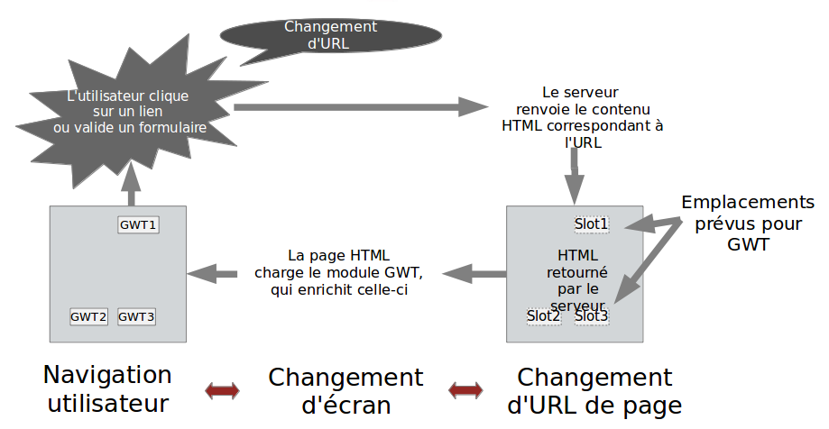
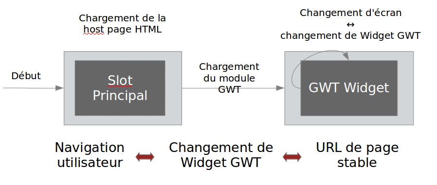
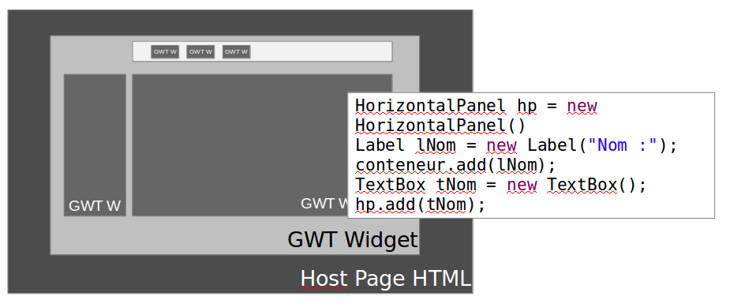
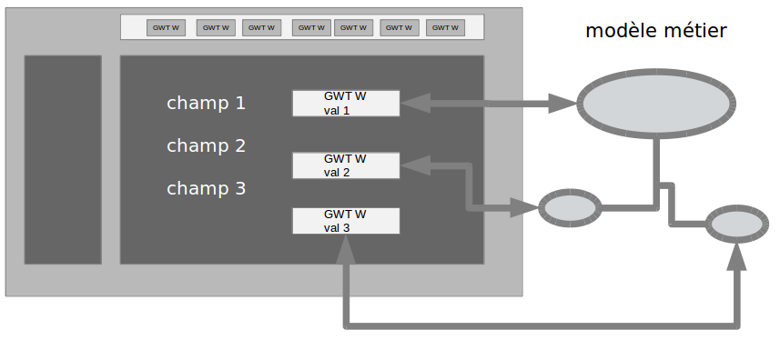
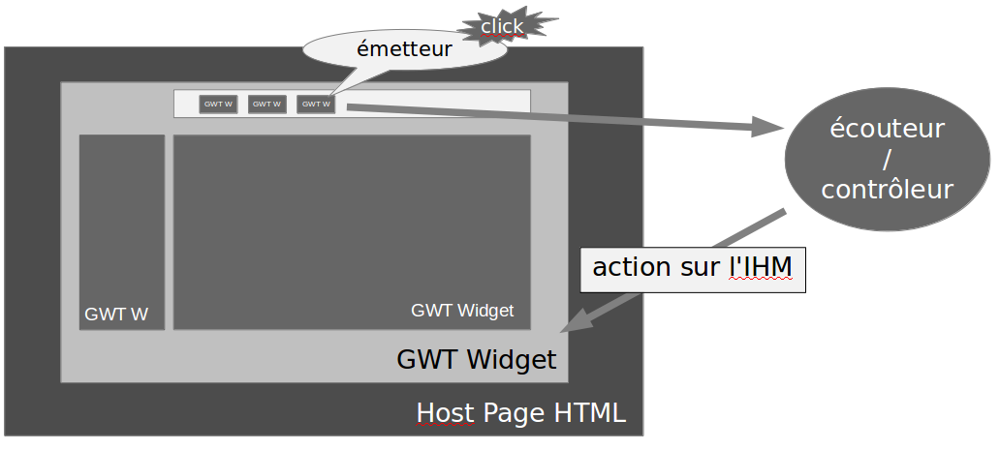
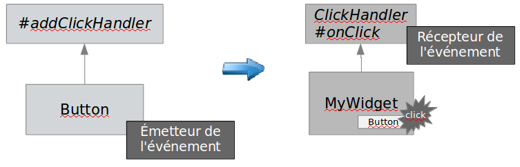
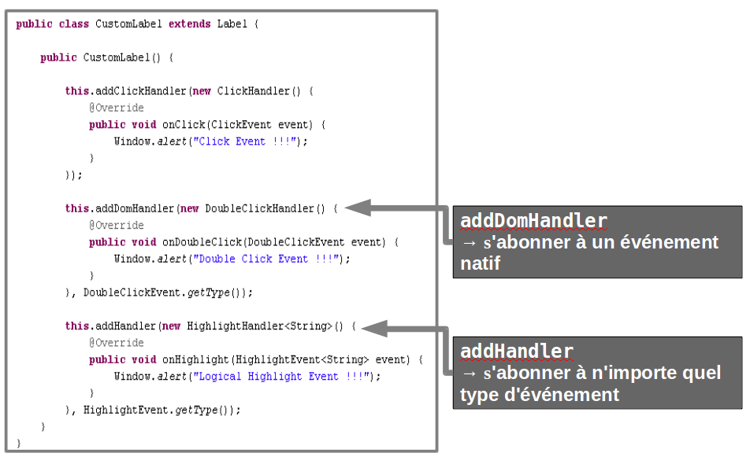

# Les principes de GWT

<!-- .slide: class="page-title" -->


## Différentes utilisations de GWT

- Il existe deux types d'utilisation de GWT pour une application Web
- Web 2.0 « Light »
	- GWT est utilisé de façon parcimonieuse pour enrichir une application web 1.0 classique
- Web 2.0 « Rich Client »
	- Toute l'application est construite avec GWT, qui devient le framework structurant de la partie cliente de l'application
Notes :


## L'approche Web 2.0 « Light » (1/3)

- En général, l'approche « light » est utilisée pour améliorer une application Web existante
	- Application de gestion réalisée avec la technologie JSP/Servlet ou Struts
	- Portail, site statique, etc...
- L'approche « light » permet de
	- Corriger une ergonomie sommaire
	- Simplifier la navigation
Notes :


## L'approche Web 2.0 « Light » (2/3)

- L'IHM du site est générée par le serveur
	- Le site est composé de plusieurs pages HTML/JSP, donc de plusieurs URLs
	- Le module GWT référencé dans chaque page, permet d'en enrichir une portion
- Le module GWT est peu volumineux
	- Pas d'impact significatif en terme de charge sur l'application Web
Notes :


## L'approche Web 2.0 « Light » (3/3)



Remarque : en mode « Light », l'URL de l'application change après chaque action, ce qui entraîne un rechargement complet de la vue
Notes :


## L'approche Web 2.0 « Rich Client » (1/3)

- Soit pour la refonte totale d'une application de gestion
	- Adhérer à une ergonomie adaptée à la complexité du métier
	- Améliorer l'intuitivité
	- Permettre des contrôles de saisie et des retours d'erreur plus poussés
- Soit pour une application Web 2.0 typique
	- Intranet, WebMail, Calendar ...
	- Problématiques associées de montée en charge
Notes :


## L'approche Web 2.0 « Rich Client » (2/3)

- Contenu riche sémantiquement
	- Représentation typée du modèle métier côté client
	- Ajout de contrôles de saisie et/ou de règles de gestion sur le poste client
- Les IHMs sont générées par le client
	- Une unique host page HTML donc une seule URL visible
- Le module GWT peut devenir volumineux
	- Vérifier les temps de chargement perçus
	- « User experience »
Notes :


## L'approche Web 2.0 « Rich Client » (3/3)


Remarque : en mode « Rich Client », l'URL de l'application ne change jamais→l'application est chargée une seule fois (au démarrage)
Notes :


## Les grands principes du modèle GWT

- L'unicité de l'URL
- La Composition
- L'Encapsulation
- Le modèle événementiel
- La Synchronisation Modèle/IHM (Databinding)
Notes :


## L'unicité de l'URL

- Navigation en mode « Single Page Interface » (SPI)
- Il ne s'agit plus de naviguer de pages en pages en réaffichant à chaque aller-retour une page entière
	- Fin de l'effet « page blanche »
	- Seul ce qui nécessite une mise à jour est mis à jour
- Activation/désactivation de fragments ou blocs de pages
	- Amélioration du temps de réponse
	- Ergonomie optimale → proche du client lourd
Notes :


## La Composition

<figure>
    
</figure>

Permet une architecture orientée composant et développée en couches

- Augmente la réutilisation et l'évolutivité
- Facilite la maintenance


Notes :


## L'encapsulation (1/2)


Notes :


## L'encapsulation (2/2)

- Permet de transformer les éléments HTML, pauvres en sens et en comportements, en composants riches sémantiquement
- Rappel du concept Objet : un objet encapsule de façon cohérente des données (propriétés) et des comportements (méthodes)
- Avantages
	- Abstraction
	- Réutilisabilité
	- Coût de maintenance
Notes :


## Le Databinding

- La synchronisation modèle métier/IHM

<figure>
    
</figure>


Constitue l'essentiel du code à écrire pour concevoir les écrans, il peut être implémenté de multiples façons
Notes :


## Le modèle évènementiel




Notes :


## Les événements

- Les catégories d'événements possibles
	- Natif (ie. DOM)
		- Click , Keyboard, Mouse, Focus
	- Logique
		- Resize, Close, Highlight
- Chaque type de Widget ne peut émettre qu'un sous-ensemble d'événements parmi ceux possibles
	- Déduit de l'élément du DOM HTML correspondant
Notes :


## Liste d'événements d'un widget

- Connaître les événements émis par un Widget → Liste définie par les interfaces de typeHas*Handlersqu'implémente le widget


Notes :


## Le couple Émetteur/Récepteur


Abonnement : 
```java
button.addClickHandler(
	new ClickHandler() {
		public void onClick(ClickEvent event) {
			// TRAITEMENT A EFFECTUER
			// SUR UN CLIC BOUTON
		}
});
```


Notes :


## S'abonner à un événement




Notes :


<!-- .slide: class="page-questions" -->
