# Les Widgets

<!-- .slide: class="page-title" -->


## et le Développement d'IHMs

Notes :


## Les principaux objets de GWT

- Les widgets
	- Composants graphiques
	- Bouton, Liste, Label ...
- Les panels
	- Composants graphiques non visibles permettant de mettre en page l'application
	- Exemple : VerticalPanel, HorizontalPanel ...
- La classe DOM
	- Classe permettant de manipuler directement la structure HTML (ie. DOM) du browser
- La classe Window
	- Classe permettant d'interagir avec la fenêtre du browserpar exemple :Window.alert("Bonjour");
Notes :


## Les Widgets de GWT

Notes :


## Les Widgets

- Les widgets représentent les portions visuelles de l'écran

```

```

```

```
GWT Widget

```

```

```

```

```

```

```
GWT W
```

```
GWT W
```

```
GWT W
```
GWT WidgetHost Page HTMLGWT W
Notes :


## Hiérarchie des widgets


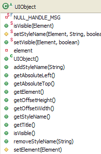
encapsulation de l'avatar

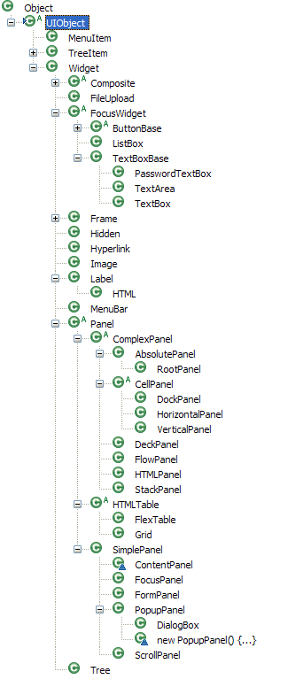
Classe racine des widgets GWT
Notes :


## Les widgets standards

- Un widget est fourni pour chaque balise HTML courante
	- Éléments de formulaires HTML
	- Image, Label …
- Quelques Widgets
	- Bouton
	- Zone de texte
	- Arbre
	- Éditeur de Texte
- Liste complète→ Showcase GWT

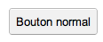


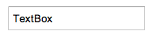


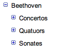


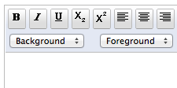

Notes :


## La mise en forme

- La mise en forme peut être réalisée de deux façons différentes
- Par les attributs de mise de forme
	- Facile à mettre en œuvre
	- Mais solution incomplète
	- Par exemple, setColor() n'existe pas
- Par les classes CSS
	- Solution plus générique et plus puissante
	- La plupart des Widgets GWT possèdent déjà un style par défaut…label.setWidth("100px");label.setHeight("20px");……label.setStyleName("label-moyen");…
Notes :


## Les Panels

Notes :


## Panels (1/2)

- Un panel est un conteneur utilisé pour composer et organiser des widgets sur un écran
- Un modèle de placement (layout manager) associé à un panel permet de positionner les widgets selon une stratégie particulière
- Différentes stratégies de positionnement

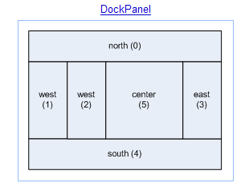


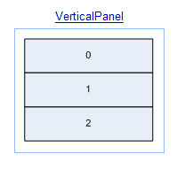


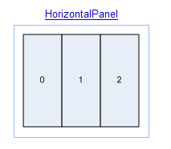

Notes :


## Panels (2/2)

- La composition est rendu souple grâce à la bibliothèque de Panel
	- Chacun est associé à une façon spécifique d'agencer des composants
- Certains Panels n'ont pas de fonctions de layout (exemple : FormPanel)

```
Panel
```

```
Widget
```
conteneurcomposant
Notes :


## Un panel spécial : Le RootPanel

- Permet d'insérer des widgets GWT dans les emplacements prévus par la Host HTML PageRootPanel root = RootPanel.get("slot1");root.add(myWidgetEcran1);Insère le widget dans le tag HTMLen fin de contenuRootPanel root = RootPanel.get();root.clear();root.add(myWidgetEcran1);RootPanel associé au tagbodyEfface le contenu de la balise
Notes :


## VerticalPanel

- Agence les composants verticalement suivant l'ordre dans lequel ils sont ajoutés


…VerticalPanel panel =newVerticalPanel();Label label0 =newLabel("0");panel.add(label0);Label label1 =newLabel("1");panel.add(label1);Label label2 =newLabel("2");panel.add(label2);RootPanel.get("slot1").add(panel);…
Notes :


## HorizontalPanel

- Agence les composants horizontalement suivant l'ordre dans lequel ils sont ajoutés


…HorizontalPanel panel =newHorizontalPanel();Label label0 =newLabel("0");panel.add(label0);Label label1 =newLabel("1");panel.add(label1);Label label2 =newLabel("2");panel.add(label2);RootPanel.get("slot1").add(panel);…
Notes :


## DockPanel

- Agence les composants avec une disposition de type documentDockPanel panel =newDockPanel();Label north =newLabel("North");panel.add(north,DockPanel.NORTH);Label west1 =newLabel("West");panel.add(west1,DockPanel.WEST);Label west2 =newLabel("West");panel.add(west2,DockPanel.WEST);Label south =newLabel("South");panel.add(south,DockPanel.SOUTH);RootPanel.get("slot1").add(panel);…


Notes :


## Les autres Panel

- StackPanel ou « panel accordéon », Empile les composants verticalement en affichant seulement un composant à la fois
- HTMLPanel permet d'insérer un contenu (texte) HTML récupéré par exemple du serveur
- DeckPanel contient plusieurs composants mais n'en affiche qu'un seul à la fois
- FlowPanel agence ses composants à la manière d'un div HTML
- TabPanel utilisé conjointement avec TabBar permet une navigation par Onglet

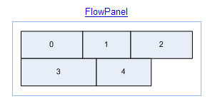


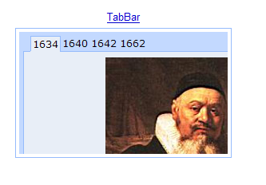

Notes :


## Conclusion sur les Panels

- Il n'y a pas de classe CSS par défaut pour les Panels
- Mais l'utilisation des classes CSS permet une souplesse infinie pour définir des layouts
- Comme pour les Widgets simples, il est possible d'en définir d'autres pour proposer d'autres layouts
- Les Panels complexes (StackPanel, TabPanel, DialogBox) sont le résultat d'une composition permettant d'implémenter des comportements de plus haut niveau
- Ils peuvent être utilisés tels quels ou servir de base pour l'implémentation d'autres composants à l'ergonomie ou au design plus aboutis
Notes :


## TP 2

Notes :


## Layout Panels (1/4)

- GWT 1.0 utilise principalement la balise<table>comme base de positionnement et du Javascript pour le redimensionnement
- La balise<table>comporte certaines limites
	- Dégradation des performances d'affichage sur certains navigateurs
	- Comportements différent selon le mode de rendu standard ou quirks
Notes :


## Layout Panels (2/4)

- GWT 2.0 introduit un nouveau modèle de placement basé sur le standard CSS avec lesLayout Panels
- L'idée est de
	- Proposer un comportement prédictible au pixel près
	- Ne fonctionner qu'en mode standard HTML
	- Déléguer le travail au moteur de rendu des navigateurs et non à du code Javascript pour des raisons de performances et d'efficacité
- Le principe
	- Le modèle de positionnement utilise la balise<div>et redéfinit l'attributstyle
- Ne fonctionne qu'en mode Standard HTML
Notes :


## Layout Panels (3/4)

- GWT 2.0 a introduit de nouveaux panels respectant ce nouveau modèle de placement par CSS
	- RootLayoutPanel
	- LayoutPanel (panel simple respectant le modèle des Layouts)
	- DockLayoutPanel
	- SplitLayoutPanel
	- StackLayoutPanel
	- TabLayoutPanel
Notes :


## Layout Panels (4/4)

- Les Layout Panels doivent être utilisés afin de définir le « corps » de l'application
	- Continuer d'utiliser les panels standards pour les composants « finaux »...
	- …tout en privilégiant le positionnement via des styles css
- L'utilisation d'un Layout Panel nécessite que la hiérarchie complète (du RootLayoutPanel au panel en question) implémente les interfaces RequiresResize et ProvidesResize
- Dans le cas d'un Composite qui encapsule un widget qui implémente RequiresResize, il faut hériter de ResizeComposite au lieu de Composite
Notes :


## Les HTMLTables

Notes :


## HTMLTable

- HTMLTable encapsule l'élément HTML table
- Permettent de représenter des listes d'éléments de même nature
	- Grid pour la gestion de tableaux statiques : ses dimensions (nombre de lignes et colonnes) doivent être précisées de façon explicite
	- FlexTable pour la gestion de tableaux dynamiquesGrid grid =newGrid(3,2);grid.setWidget(0, 0,newLabel("Nom:"));TextBox textNom =newTextBox();textNom.setName("nom");grid.setWidget(0, 1,textNom);
Notes :


## FlexTable

- Identique à Grid mais plus adapté à une évolution dynamique du tableau → l'ajout d'une ligne ou d'une colonne ne déclenche pas la reconstruction totale du tableauList<Operateur> data = listeOperateur();finalFlexTable flexTable =newFlexTable();for(Operateur op : data) {introwCount = flexTable.getRowCount();flexTable.setText(rowCount, 0, op.getLogin());flexTable.setText(rowCount, 1, op.getCourriel());}finalButton button =newButton("Ajouter Operateur");flexTable.setWidget(flexTable.getRowCount(), 1, button);button.addClickHandler(newClickHandler() {public voidonClick(ClickEvent event) {int rowCount = flexTable.getRowCount();flexTable.setWidget(rowCount - 1, 0,newTextBox());flexTable.setWidget(rowCount - 1, 1,newTextBox());}});
Notes :


## Conclusion sur les HTMLTable

- Les tableaux proposés restent basiques et ne proposent pas de fonctions évoluées
	- Tri sur colonne
	- Pagination
	- Instanciation concise
	- Fonction de saisie
- GWT fournit maintenant une CellTable qui permet de faire des listes qui répondent aux besoins ci-dessus
Notes :


## CellTable (1/3)

- Une CellTable permet d'afficher directement des objets du domaine métier sans avoir à créer soi-même la table html.
- Chaque colonne de la table doit définir son propre rendererCellTable<Contact> table =newCellTable<Contact>();TextColumn<Contact> nameColumn =newTextColumn<Contact>() {@OverridepublicString getValue(Contact contact) {returncontact.name;}};TextColumn<Contact> addressColumn =newTextColumn<Contact>() {@OverridepublicString getValue(Contact contact) {returncontact.address;}};table.addColumn(nameColumn,"Name");table.addColumn(addressColumn,"Address");
Notes :


## CellTable (2/3)

- Le binding entre la CellTable et la source données est assurée par un ListDataProvider
- Binding de la cellTable
- Binding de la source de données
- La CellTable va automatiquement refléter le contenu de la sourceListDataProvider<Contact> dataProvider =newListDataProvider<Contact>();dataProvider.addDataDisplay(table);dataProvider.setList(CONTACTS);

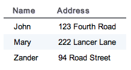

Notes :


## CellTable (3/3)

- D'autres fonctionnalités intéressantes sont fournies
	- Tri des colonnes
	- Pagination
- Les CellWidgets permettent d'afficher différents types de widgets dans les colonnes
	- ClickableTextCell
	- ButtonCell
	- CheckboxCell
	- DatePickerCell
	- ...
Notes :


## Les Popups

Notes :


## PopupPanel

- Permet d'afficher un contenu contextuel et modalfinalLabel label =newLabel("GWT");finalPopupPanel popupPanel =newPopupPanel(true);popupPanel.add(newHTMLPanel("<p>GWT est un toolkit développé par Google</p>"));label.addClickHandler(newClickHandler() {@OverridepublicvoidonClick(ClickEvent event) {popupPanel.setPopupPosition(label.getAbsoluteLeft() + 10,label.getAbsoluteTop() + 10);popupPanel.show();}});RootPanel.get().add(label);


Notes :


## DialogBox

- Permet d'afficher une fenêtre popup modale, qui peut être déplacée avec la souris


Notes :


## Les menus

Notes :


## Mise en œuvre de menus (1/2)

- MenuBar est un conteneur de MenuItems. Il peut être vertical ou horizontal
- Les MenuItems permettent d'appeler des Commandes ou d'ouvrir des MenuBar


Notes :


## Mise en œuvre de menus (2/2)
MenuBarmenu=newMenuBar();MenuBar subMenu =newMenuBar(true);subMenu.addItem("<u>Underlined</u>",true,newCommand(){public voidexecute(){Window.alert("click");}});MenuBar menu0 =newMenuBar(true);menu0.addItem("More &#187;",true, subMenu);MenuBar menu1 =newMenuBar(true);menu1.addItem("<font color='#8B4513'><b>Donut</b></font>",true,this);MenuBar menu2 =newMenuBar(true);menu2.addItem("<code>w00t!</code>",true,this);menu.addItem(newMenuItem("Style", menu0));menu.addItem(newMenuItem("Fruit", menu1));menu.addItem(newMenuItem("Term", menu2));


```

```

```

```
menumenu0subMenu
Notes :


## TP 3

Notes :


<!-- .slide: class="page-questions" -->


<!-- .slide: class="page-tp1" -->