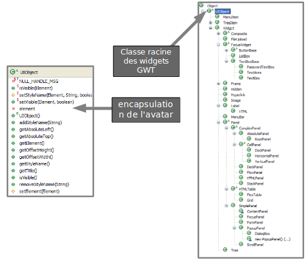

# Les Widgets et le Développement d'IHMs

<!-- .slide: class="page-title" -->

Notes :


## Les principaux objets de GWT (1/2)

- Les widgets
	- Composants graphiques
	- Bouton, Liste, Label ...
- Les panels
	- Composants graphiques non visibles permettant de mettre en page l'application
	- Exemple : `VerticalPanel`, `HorizontalPanel`...

Notes :


## Les principaux objets de GWT (2/2)

- La classe `DOM`
	- Classe permettant de manipuler directement la structure HTML (ie. DOM) du browser
- La classe `Window`
	- Classe permettant d'interagir avec la fenêtre du browser par exemple : `Window.alert("Bonjour");`


# Les Widgets de GWT
<!-- .slide: class="page-title" -->

Notes :


## Les Widgets

- Les widgets représentent les portions visuelles de l'écran


Notes :


## Hiérarchie des widgets



Notes :


## Les widgets standards

- Un widget est fourni pour chaque balise HTML courante
	- Éléments de formulaires HTML
	- Image, Label …
- Quelques Widgets
	- Bouton
	- Zone de texte
	- Arbre
	- Éditeur de Texte
- Liste complète→ Showcase GWT

<figure style="position: absolute; bottom: 50%; right: 50%;">
    
</figure>

<figure style="position: absolute; bottom: 50%; right: 25%;">
    
</figure>

<figure style="position: absolute; bottom: 30%; right: 50%;">
    
</figure>

<figure style="position: absolute; bottom: 30%; right: 25%;">
    
</figure>

Notes :


## La mise en forme (1/2)

- La mise en forme peut être réalisée de deux façons différentes
- Par les attributs de mise de forme
	- Facile à mettre en œuvre
	- Mais solution incomplète
	- Par exemple, `setColor()` n'existe pas

```java
	…
	label.setWidth("100px");
	label.setHeight("20px");
```

Notes :


## La mise en forme (2/2)

- Par les classes CSS
	- Solution plus générique et plus puissante
	- La plupart des Widgets GWT possèdent déjà un style par défaut

```java
	……
	label.setStyleName("label-moyen");
	…
```


# Les Panels
<!-- .slide: class="page-title" -->

Notes :


## Panels (1/2)

- Un panel est un conteneur utilisé pour composer et organiser des widgets sur un écran
- Un modèle de placement (layout manager) associé à un panel permet de positionner les widgets selon une stratégie particulière
- Différentes stratégies de positionnement

<figure style="position: absolute; bottom: 10%; right: 55%;">
    
</figure>

<figure style="position: absolute; bottom: 10%; right: 35%;">
    
</figure>

<figure style="position: absolute; bottom: 10%; right: 10%;">
    
</figure>

Notes :


## Panels (2/2)

- La composition est rendue souple grâce à la bibliothèque de Panel
	- Chaque Panel a une façon spécifique d'agencer des composants

	
- Certains Panels n'ont pas de fonction de layout (exemple&nbsp;:&nbsp;`FormPanel`)

Notes :


## Un panel spécial : le RootPanel

- Permet d'insérer des widgets GWT dans les emplacements prévus par la Host HTML Page


Notes :


## VerticalPanel

- Agence les composants verticalement suivant l'ordre dans lequel ils sont ajoutés

```java
…
VerticalPanel panel = new VerticalPanel();
Label label0 = new Label("0");
panel.add(label0);
Label label1 = new Label("1");
panel.add(label1);
Label label2 = new Label("2");
panel.add(label2);
RootPanel.get("slot1").add(panel);
…
```
<figure style="position: absolute; bottom: 20%; right: 15%;">
    
</figure>

Notes :


## HorizontalPanel

- Agence les composants horizontalement suivant l'ordre dans lequel ils sont ajoutés

```java
…
HorizontalPanel panel = new HorizontalPanel();
Label label0 = new Label("0");
panel.add(label0);
Label label1 = new Label("1");
panel.add(label1);
Label label2 = new Label("2");
panel.add(label2);
RootPanel.get("slot1").add(panel);
…
```
<figure style="position: absolute; bottom: 20%; right: 15%;">
    
</figure>

Notes :


## DockPanel

- Agence les composants avec une disposition de type document

```java
DockPanel panel = new DockPanel();
Label north = new Label("North");
panel.add(north,DockPanel.NORTH);
Label west1 = new Label("West");
panel.add(west1,DockPanel.WEST);
Label west2 = new Label("West");
panel.add(west2,DockPanel.WEST);
Label south = new Label("South");
panel.add(south,DockPanel.SOUTH);
RootPanel.get("slot1").add(panel);
…
```

<figure style="position: absolute; bottom: 25%; right: 15%;">
    
</figure>

Notes :


## Les autres Panel

- StackPanel ou « panel accordéon », Empile les composants verticalement en affichant seulement un composant à la fois
- HTMLPanel permet d'insérer un contenu (texte) HTML récupéré par exemple du serveur
- DeckPanel contient plusieurs composants mais n'en affiche qu'un seul à la fois
- FlowPanel agence ses composants à la manière d'un div HTML
- TabPanel utilisé conjointement avec TabBar permet une navigation par Onglet

<figure style="position: absolute; bottom: -4%; right: 65%;">
    
</figure>

<figure style="position: absolute; bottom: -8%; right: 5%;">
    
</figure>

Notes :


## Conclusion sur les Panels

- Il n'y a pas de classe CSS par défaut pour les Panels
- Mais l'utilisation des classes CSS permet une souplesse infinie pour définir des layouts
- Comme pour les Widgets simples, il est possible d'en définir d'autres pour proposer d'autres layouts
- Les Panels complexes (StackPanel, TabPanel, DialogBox) sont le résultat d'une composition permettant d'implémenter des comportements de plus haut niveau
- Ils peuvent être utilisés tels quels ou servir de base pour l'implémentation d'autres composants à l'ergonomie ou au design plus aboutis
Notes :


<!-- .slide: class="page-questions" -->

<!-- .slide: class="page-tp2" -->

Notes :


## Layout Panels (1/4)

- GWT 1.0 utilise principalement la balise `<table>` comme base de positionnement et du Javascript pour le redimensionnement
- La balise `<table>` comporte certaines limites
	- Dégradation des performances d'affichage sur certains navigateurs
	- Comportement différent selon le mode de rendu standard ou quirks
Notes :


## Layout Panels (2/4)

- GWT 2.0 introduit un nouveau modèle de placement basé sur le standard CSS avec la classe `Layout Panel`
- L'idée est de
	- Proposer un comportement prédictible au pixel près
	- Ne fonctionner qu'en mode standard HTML
	- Déléguer le travail au moteur de rendu des navigateurs et non à du code Javascript pour des raisons de performances et d'efficacité
- Le principe
	- Le modèle de positionnement utilise la balise `<div>` et redéfinit l'attribut `style`
Notes :


## Layout Panels (3/4)

- Ne fonctionne qu'en mode Standard HTML
- GWT 2.0 a introduit de nouveaux panels respectant ce nouveau modèle de placement par CSS
	- `RootLayoutPanel`
	- `LayoutPanel` (panel simple respectant le modèle des Layouts)
	- `DockLayoutPanel`
	- `SplitLayoutPanel`
	- `StackLayoutPanel`
	- `TabLayoutPanel`
Notes :


## Layout Panels (4/4)

- Les Layout Panels doivent être utilisés afin de définir le « corps » de l'application
	- Continuer d'utiliser les panels standards pour les composants «&nbsp;finaux&nbsp;»...
	- …tout en privilégiant le positionnement via des styles css
- L'utilisation d'un Layout Panel nécessite que la hiérarchie complète (du `RootLayoutPanel` au panel en question) implémente les interfaces `RequiresResize` et `ProvidesResize`
- Dans le cas d'un élément `Composite` qui encapsule un widget qui implémente `RequiresResize`, il faut hériter de `ResizeComposite` au lieu de `Composite`
Notes :


<!-- .slide: class="page-title" -->
# Les HTMLTables

Notes :


## HTMLTable

- HTMLTable encapsule l'élément HTML table
- Permettent de représenter des listes d'éléments de même nature
	- Grid pour la gestion de tableaux statiques : ses dimensions (nombre de lignes et colonnes) doivent être précisées de façon explicite
```java
Grid grid = new Grid(3,2);
grid.setWidget(0, 0,new Label("Nom:"));
TextBox textNom = new TextBox();
textNom.setName("nom");
grid.setWidget(0, 1,textNom);
```
	- FlexTable pour la gestion de tableaux dynamiques
Notes :


## FlexTable

- Identique à Grid mais plus adapté à une évolution dynamique du tableau → l'ajout d'une ligne ou d'une colonne ne déclenche pas la reconstruction totale du tableau
```java
List<Operateur> data = listeOperateur();
finalFlexTable flexTable = new FlexTable();
for(Operateur op : data) {
	introwCount = flexTable.getRowCount();
	flexTable.setText(rowCount, 0, op.getLogin());
	flexTable.setText(rowCount, 1, op.getCourriel());
}
finalButton button = new Button("Ajouter Operateur");
flexTable.setWidget(flexTable.getRowCount(), 1, button);
	button.addClickHandler(newClickHandler() {
		public void onClick(ClickEvent event) {
			int rowCount = flexTable.getRowCount();
			flexTable.setWidget(rowCount - 1, 0,newTextBox());
			flexTable.setWidget(rowCount - 1, 1,newTextBox());
}});
```
Notes :


## Conclusion sur les HTMLTable

- Les tableaux proposés restent basiques et ne proposent pas de fonctions évoluées
	- Tri sur colonne
	- Pagination
	- Instanciation concise
	- Fonction de saisie
- GWT fournit maintenant une `CellTable` qui permet de faire des listes qui répondent aux besoins ci-dessus
Notes :


## CellTable (1/3)

- Une CellTable permet d'afficher directement des objets du domaine métier sans avoir à créer soi-même la table html.
```java
CellTable<Contact> table = new CellTable<Contact>();
```
- Chaque colonne de la table doit définir son propre rendu
 ```java
TextColumn<Contact> nameColumn = new TextColumn<Contact>() {
	 public String getValue(Contact contact) { 
		return contact.name;
	}
};
TextColumn<Contact> addressColumn = new TextColumn<Contact>() {
	public String getValue(Contact contact) {
		return contact.address;
	}
};
table.addColumn(nameColumn,"Name");
table.addColumn(addressColumn,"Address");
```
Notes :


## CellTable (2/3)

- Le binding entre la CellTable et la source de données est assurée par un ListDataProvider

```java
 ListDataProvider<Contact> dataProvider =
 				 new ListDataProvider<Contact>();
 ```

- Binding de la CellTable
```java
dataProvider.addDataDisplay(table);
```
- Binding de la source de données
```java
dataProvider.setList(CONTACTS);
```
- La CellTable va automatiquement refléter le contenu de la source

<figure style="position: absolute; bottom: 30%; right: 5%; border: solid 1px;">
    
</figure>

Notes :


## CellTable (3/3)

- D'autres fonctionnalités intéressantes sont fournies
	- Tri des colonnes
	- Pagination
- Les CellWidgets permettent d'afficher différents types de widgets dans les colonnes
	- `ClickableTextCell`
	- `ButtonCell`
	- `CheckboxCell`
	- `DatePickerCell`
	- ...
Notes :


<!-- .slide: class="page-title" -->
# Les Popups

Notes :


## PopupPanel

- Permet d'afficher un contenu contextuel et modal
```java
final Label label = new Label("GWT");
final PopupPanel popupPanel = new PopupPanel(true);
popupPanel.add(new HTMLPanel("<p>GWT est un toolkit développé par Google</p>"));
label.addClickHandler(
	new ClickHandler() {
		@Override
		public void onClick(ClickEvent event) {
			popupPanel.setPopupPosition(
			label.getAbsoluteLeft() + 10,
			label.getAbsoluteTop() + 10);
			popupPanel.show();
		}
	});
RootPanel.get().add(label);
```


Notes :


## DialogBox

- Permet d'afficher une fenêtre popup modale, qui peut être déplacée avec la souris


Notes :


<!-- .slide: class="page-title" -->
# Les menus

Notes :


## Mise en œuvre de menus (1/2)

- MenuBar est un conteneur de MenuItems. Il peut être vertical ou horizontal
- Les MenuItems permettent d'appeler des Commandes ou d'ouvrir des MenuBar


Notes :


## Mise en œuvre de menus (2/2)
```java
MenuBar menu = new MenuBar();
MenuBar subMenu = new MenuBar(true);
subMenu.addItem("<u>Underlined</u>", true, new Command(){
	public void execute(){ Window.alert("click");}
});
MenuBar menu0 = new MenuBar(true);
menu0.addItem("More &#187;", true, subMenu);
MenuBar menu1 = new MenuBar(true);
menu1.addItem("<font color='#8B4513'><b>Donut</b></font>",
	true,this);
MenuBar menu2 = new MenuBar(true);
menu2.addItem("<code>w00t!</code>",true,this);
menu.addItem(new MenuItem("Style", menu0));
menu.addItem(new MenuItem("Fruit", menu1));
menu.addItem(new MenuItem("Term", menu2));
```


Notes :


<!-- .slide: class="page-questions" -->


<!-- .slide: class="page-tp3" -->