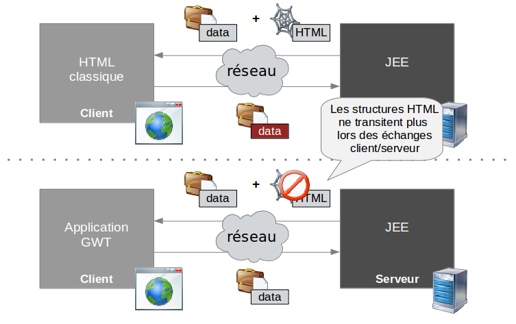
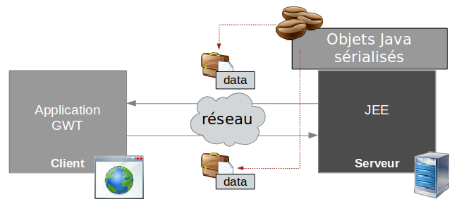
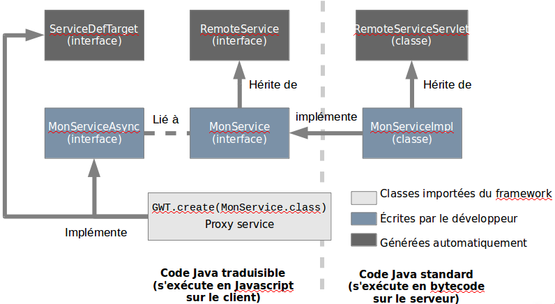
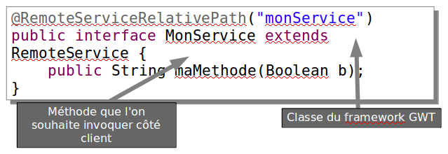
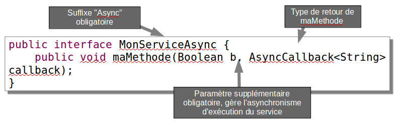
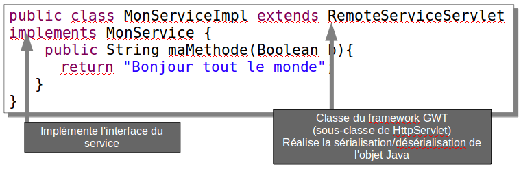

# Remote Procedure Call

<!-- .slide: class="page-title" -->

Notes :


## Différences entre application web et GWT




## Principe

- GWT fournit un mécanisme RPC afin de simplifier les communications client/serveur
- L'ensemble des données transitant entre le client et le serveur sont des objets Java sérialisés


Notes :


## Avantages (1/2)

- Même langage de développement pour les parties serveur et cliente
	- Facilité de debug (à comparer avec JavaScript)
	- Définition unique des classes (unicité des règles de gestion, des types, etc...)
	- Remarque : les applications AJAX utilisent classiquement JSON ou XML pour représenter les données, ce qui nécessite une phase d'encodage et de décodage
- « Parsing » automatique du payload HTTP effectué par GWT
	- Développement plus rapide
	- Taux d'erreur plus faible
Notes :


## Avantages (2/2)

- Retour à une ergonomie de type « client lourd »
	- Riche
	- Fluide
- Transfert d'une partie de la logique métier vers le client
	- Diminution du trafic réseau
	- Navigation plus fluide
	- Diminution de la charge du serveur qui n'a plus à gérer le contexte du client (ie. plus de `session.setAttribute()`)
- Le serveur d'application devient un serveur de services (au sens SOA) stateless donc scalable
Notes :


## RPC dans GWT



Notes :


## Mise en œuvre

- Pour réaliser un service, il faut implémenter trois classes:
	- Interface du service
	- Implémentation du service
	- Interface asynchrone du service
- Il faut aussi déclarer le service dans le fichier `web.xml`
- Fonctionnement
	- Le mécanisme RPC de GWT s'appuie sur l'objet XMLHTTPRequest qui est déjà au cœur des frameworks AJAX
	- XMLHTTPRequest permet, depuis Javascript, d'envoyer une requête au serveur asynchrone (afin de ne pas bloquer le navigateur)
Notes :


## L'interface EntryPoint

- L'interface de service décrit l'ensemble des méthodes distantes disponibles
- L'interface du service doit être placée dans un package coté client


L'annotation `RemoteServiceRelativePath` doit être positionnée pour associer à chaque service un chemin relatif au module par défaut
Notes :


## Interface asynchrone du service

- Déduite entièrement de l'interface vue précédemment
- Permet de gérer l'asynchronisme lié aux contraintes Javascript

<figure>
    
    <figcaption>Le logo Zenika</figcaption>
</figure>

- L'interface asynchrone renvoie `void` mais accepte un callback
- L'interface synchrone et l'interface asynchrone doivent être situées dans le même package

Notes :


## Implémentation du service

- L'implémentation du service réalise les méthodes exposées côté serveur
- La classe de l'implémentation doit être placée dans un package coté serveur

Notes :


## Interface synchrone/asynchrone

- En mode asynchrone, l'appelant n'est pas bloqué durant l'exécution, il est prévenu lorsque la réponse est retournée
- Méthode avec type de retour déclaré dans l'interface
```java
public MonTypeDeRetour maMethode(Param1 param1, Param2 param2);
```
- Méthode correspondante déclarée dans l'interface asynchrone
```java
public void maMethode(Param1 param1, Param2 param2,
	AsyncCallback<MonTypeDeRetour> callback);
```
- Remarque: l'objet résultat (ie. type de retour) sera récupéré par l'objet AsyncCallback (cf. slides suivants)
Notes :


## Déclaration du service HTTP

- Déclaration du service en tant que servlet dans le fichier `web.xml`
```xml
<!-- GWT exported services -->
<servlet>
	<servlet-name>monService</servlet-name>
	<servlet-class>
	com.mycompany.myapp.server.gwt.MonServiceImpl
</servlet-class>
</servlet>
…
<servlet-mapping>
	<!-- Nom du module en minuscule -->
	<servlet-name>monService</servlet-name>
	<url-pattern>/mon module/monService</url-pattern>
</servlet-mapping>
```
Notes :


## Appel RPC

- Création du proxy client de service « casté » en interface asynchrone
```java
MonServiceAsync monService = GWT.create(MonService.class);
```
- Création du callback pour traiter le résultat de l'exécution
```java
AsyncCallback callback = new AsyncCallback<String>() {
	public void onSuccess(String result) {
	// je peux manipuler mon résultat de retour
	}
	public void onFailure(Throwable caught) {
	// je peux traiter les erreurs techniques 
	}
};
```
- Invocation du service 
```java
monService.maMethode(param1, param2, callback);
```
Notes :


## Remarques

- Si le service est invoqué plusieurs fois, il est nécessaire de conserver une référence vers le proxy afin d'éviter une instanciation coûteuse en temps
- De même si le service doit être invoqué de façon certaine, il est préférable d'avancer son instanciation (pas de "lazy-init")
Notes :


## GWT-RPC sérialisation (1/5)

- Les objets Java qui transitent sur le réseau doivent être sérialisés/désérialisés → GWT RPC s'en charge pour vous
- Mécanisme de sérialisation propriétaire à Google → ne pas confondre avec celui de Java basé sur l'interface Serializable
- GWT RPC impose que tous les paramètres et types de retour des méthodes soient sérialisables
Notes :


## GWT-RPC sérialisation (2/5)

- Types sérialisables→ arguments ou type de retour acceptés par les services RPC
	- Les types primitifs comme `char`, `byte`, `short`, `int`, `long`, `boolean`, `float` ou `double`;
	- Les classes `String`, `Date`, ou les classes « wrapper » de type primitif comme `Character`, `Byte`, `Short`, `Integer`, `Long`, `Boolean`, `Float` ou `Double`
	- Les tableaux de types sérialisables
	- `List`, `Map` et `Set`
Notes :


## GWT-RPC sérialisation (3/5)

- Types sérialisables→ arguments ou type de retour acceptés par les services RPC
	- Les classes de l'application sérialisables
	- Les classes possédant au moins une sous-classe sérialisable
	- Les sous-classes d'une classe sérialisable dont toutes les propriétés sont sérialisables

Notes :


## GWT-RPC sérialisation (4/5)

- Sérialisation des classes de l'application
	- Doivent implémenter java.io.Serializable
	- Toutes les propriétés non déclarées transient doivent être sérialisables
	- Constructeur vide obligatoire
- Polymorphisme
	- Le polymorphisme est accepté mais peu efficace
	- Le compilateur ne peut pas déterminer le sous-ensemble de méthodes réellement utilisé et ne peut donc pas optimiser le code Javascript généré

Notes :


## GWT-RPC sérialisation (5/5)

- Le compilateur fournit des fichiers `*gwt.rpc` contenant le descriptif des types pouvant être sérialisés
	- il doivent être inclus dans toutes les livraisons de l'application

Notes :


## GWT-RPC gestion des erreurs (1/4)

- Les causes d'échecs lors de l'appel à un service peuvent être multiples
	- Panne réseau, panne serveur, erreur lors de exécution du service (mauvais paramètre, niveau d'accréditation non rempli, panne de SGBD, etc...)
- GWT les traduit sous forme d'Exceptions java

Notes :


## GWT-RPC gestion des erreurs (2/4)

- Il existe deux catégories d'exceptions
	- Les exceptions déclarées
		- Erreurs prévues par le service
	- Les exceptions non déclarées
		- Le service est injoignable
		- Le service a lancé une exception non déclarée (ne doit pas se produire quand le service a été bien conçu)

Notes : 


## GWT-RPC gestion des erreurs (3/4)

- Les erreurs déclarées
	- Retournées lors de l'exécution du service
	- Déclarées dans l'interface du service (attention elles doivent être sérialisables)
```java
AsyncCallback<Void> callback = new AsyncCallback<Void>() {
	public void onFailure(Throwable caught) {
		if( caught instanceof MonException1){
			MonException1 ex = (MonException1) caught;
			// faire quelque chose
		}else if(caught instanceof MonException2){
			// faire quelque chose d'autre
		}
}
public interface MonService extends RemoteService {
		public void maMethode(String param)throws MonException1,
			MonException2)
}
```
Notes :


## GWT-RPC gestion des erreurs (4/4)

- Les erreurs non déclarées
	- L'appel RPC n'a pas atteint le serveur (problèmes réseaux, DNS, etc)
	- Le service a retourné une erreur non prévue (ie. RuntimeException)
- Une exception InvocationException est passée à la callback
```java
AsyncCallback<Void> callback = new AsyncCallback<Void>() { 
	public void onFailure(Throwable caught) {
		if(caught instanceof InvocationException){
			// problème réseau ou erreur inconnue
			InvocationException ex = 
				(InvocationException) caught;
		}
	}
});
```
Notes :


## Autres modes d'appels (1/3)

- Requêtes HTTP en mode asynchrone sans sérialisation
	- Module GWT séparé : `com.google.gwt.http.HTTP`
	- Classe principale: `com.google.gwt.http.client.RequestBuilder`
	- Méthodes `GET` et `POST`
	- Possibilité de déclarer un timeout
	- A utiliser pour récupérer du contenu textuel (HTML, XML) en provenance d'autres sites et depuis des back-ends non Java. Ex&nbsp;:&nbsp;un WebService PHP
Notes :


## Autres modes d'appels (2/3)

- JSON
	- Dialogue avec une couche service située sur un serveur non-Java
	- Censé être plus rapide que RPC car la phase sérialisation/désérialisation est moins coûteuse (les navigateurs décodent le JSON nativement)
Notes :


## Autres modes d'appels (3/3)

- XML
	- Une classe unique `com.google.gwt.xml.client.XMLParser` pour la lecture et l'écriture de fichiers XML
- Lecture et manipulation d'un fichier XML existant
	- Une méthode `parse()` pour parser un fichier XML existant
	- Une méthode `getDocumentElement()` pour obtenir l'élément racine, une fois la méthode `parse()` appelée
- Création et écriture d'un fichier XML from scratch
	- Une méthode `createDocument()` pour créer un document from scratch
Notes :


## Conclusion

- L'asynchronisme entraîne plus de complexité en développement
- Permet la parallélisation des tâches → aucun blocage d'interface graphique
- Réduction du temps d'exécution global → la construction des widgets peut être parallélisée avec les chargements RPC
- La partie serveur de la couche RPC est donc la façade d'une architecture orientée services (SOA)
- L'implémentation peut être très légère, les services RPC constituent une gateway vers une couche service existante et scalable (Spring, EJB, legacy, etc...)
Notes :


<!-- .slide: class="page-questions" -->


<!-- .slide: class="page-tp4" -->