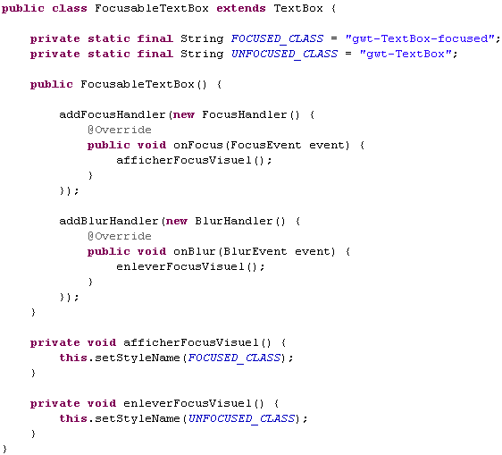
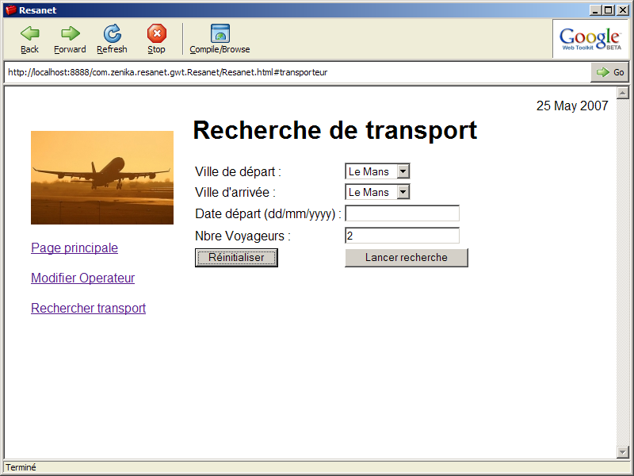
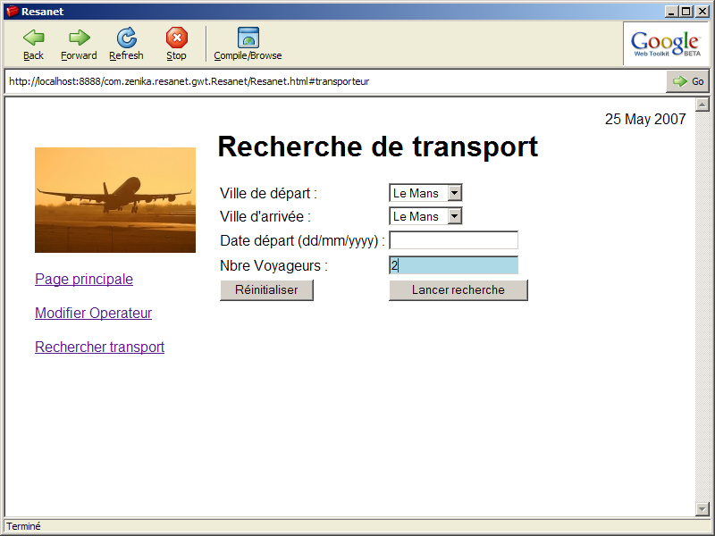

# Développement de composants

<!-- .slide: class="page-title" -->

Notes :


## Approche orientée composant (1/2)

- Il est fortement conseillé d'adopter une approche composant lors de la mise en place d'une application GWT
	- Autonomie (pas de dépendances sur du code externe)
	- Encapsulation
	- Réutilisabilité
	- Facilité de maintenance
Notes :


## Approche orientée composant (2/2)

- Adapté pour une vision projet à moyen/long terme
- Pour faciliter cela, Google a pensé ses APIs pour l'extensibilité et la redéfinition
	- Il a toujours été possible et encouragé de créer ses widgets
	- Du fait des APIs stables, il n'y a eu historiquement quasi aucun changement suite à une montée de version
Notes :


## Première approche : L'héritage

- Hériter d'un widget standard GWT et redéfinir le comportement
- Exemple
	- Un champ texte changeant de couleur lors de la prise de focus
	- La classe GWT à étendre est TextBox
	- Ajouter si nécessaire des écoutes d'événements
- Cette approche n'est pas à privilégier, préferer la composition
	- Principe du « Composition over inheritance »
Notes :


## Exemple d'héritage (1/2)




Notes :


## Exemple d'héritage (2/2)


<figure>
    
</figure>

Après définition de la classe CSS: 

```css
.gwt-TextBox-focused{background-color:lightblue;}
```

<figure>
    
</figure>


Notes :


## Deuxième approche : La composition

- Créer un widget spécialisé qui encapsule un ou plusieurs autres widgets
- Pour cela, GWT fournit la classe Composite
```java 
public class MonWidgetComposite extends Composite {
	public MonWidgetComposite(){ 
		FlowPanel mainElement = new FlowPanel();
		…
		this.initWidget(mainElement);
	}
	…
}
```
- Permet de masquer les méthodes internes du composant encapsulé
- Facilite l'évolutivité en permettant de changer l'implémentation interne du Composite sans impacter les autres widgets

Notes :


## Les librairies de composants existantes

- Plusieurs acteurs du marché fournissent des librairies de composant
	- Smart GWT (anciennement GWT-Ext) :
	- Wrappe l'API JavaScript Smart Client via du code JSNI
	- GXT (anciennement Ext-GWT)
	- Composants « Full Java »
- Il est recommandé de limiter leur utilisation tant que cela n'est pas absolument nécessaire
Notes :


## Stratégie de développement (1/2)

- Utiliser les widgets de base de GWT
- Avantages
	- Simplicité de mise en œuvre
	- Palette de composants assez complète et prête à l'emploi
- Inconvénients
	- Ergonomie, design et comportement relativement fixes et rustiques
		- Pas de drag n'drop
		- API relativement de bas niveau
Notes :


## Stratégie de développement (2/2)

- Développer ses propres composants
- Avantage
	- Ergonomie et design à la demande
	- Encapsulation de comportements
		- Databinding, typage fort, validation à la saisie, instanciation concise ... → code clair et de haut niveau fonctionnel
- Inconvénients
	- Code relativement difficile à écrire et à maintenir
	- Coûteux en temps sur un petit projet
	
Notes :


<!-- .slide: class="page-questions" -->


<!-- .slide: class="page-tp5" -->