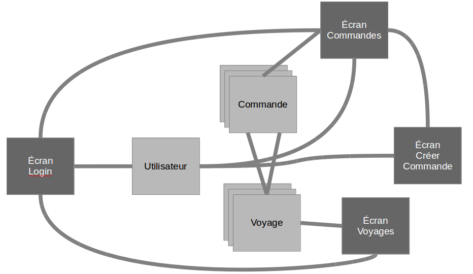
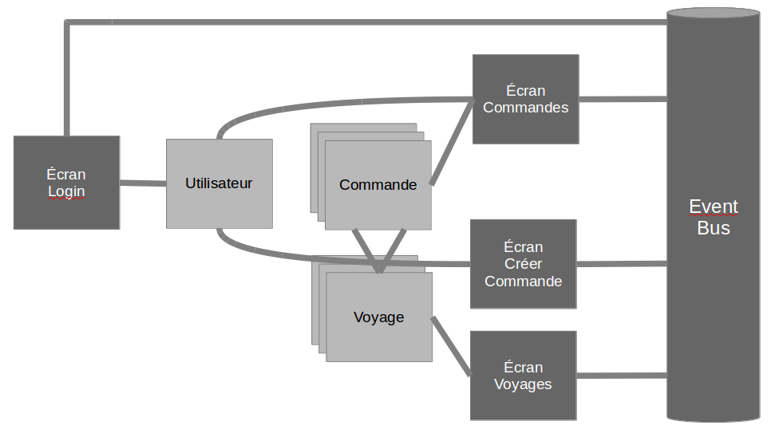

# Événements

<!-- .slide: class="page-title" -->

Notes :


## Les événements personnalisés dans GWT

- Les événements dans une architecture logicielle assurent un couplage faible entre composants/écrans
	- Maintenabilité
	- Évolutivité
- GWT fournit une API permettant de créer facilement des événements personnalisés
- Pour un composant GWT, il est possible d'utiliser les événements personnalisés afin de communiquer avec
	- Son parent
	- L'ensemble de l'application
Notes :


# Événements parent-enfant
<!-- .slide: class="page-title" -->

Notes :


## Handler événement

- Tout événement personnalisé doit être associé à un `Handler`
- Un `Handler` d'événement
	- Doit hériter de `EventHandler`
	- Fournit une/plusieurs méthodes permettant d'associer une action à un événement donné
```java
	public interface LoginHandler extends EventHandler {
		void onLogin(LoginEvent event);
	}
```
Notes :


## Événement personnalisé (1/2)
```java
public class LoginEvent extends GwtEvent<LoginHandler> {
	public static Type<LoginHandler> TYPE =
		 new Type<LoginHandler>();

	private Utilisateur utilisateur = null;

	public LoginEvent(Utilisateur utilisateur) {
		this.utilisateur= utilisateur;
	}
	public Utilisateur getUtilisateur() {
		return utilisateur;
	}
	@Override
	public final Type<LoginHandler> getAssociatedType() {
		return TYPE;
	}
	@Override
	protected void dispatch(LoginHandler handler) {
	handler.onLogin(this);
	}
}
```
Notes :


## Événement personnalisé (2/2)

- Les événements personnalisés font le lien entre les différents composants/écrans de l'application
- Un événement personnalisé
	- Doit hériter de `Event<Handler>` (`Handler` doit correspondre au `Handler` précédemment créé)
	- Peut fournir plusieurs informations contextuelles (exemple : Utilisateur)
	- Doit fournir un type égal à `Type<Handler>`
	- Doit appeler l'ensemble des méthodes du `Handler` depuis la méthode `dispatch` 
Notes :


## Composant personnalisé

- Le composant peut envoyer un événement qui est transmis aux handlers enregistrés (remarque : tout widget peut envoyer un événement)
```java
public void login(Operateur operateur) { 
	fireEvent(new LoginEvent(operateur));
}
```
- Le composant parent peut enregistrer un handler afin de réagir aux événements du composant fils
```java
public class ParentComponent extends Composite {
	public ParentComponent() {
		LoginComponent component = new LoginComponent();
		component.addHandler(new LoginHandler() {
			public void onLogin(LoginEvent event) {
				Window.alert("L'utilisateur s'est connecté !");
			}
		}, LoginEvent.TYPE);
```

Notes :


<!-- .slide: class="page-title" -->
# Événements entre modules

Notes :


## Les événements au sein de l'application

- Les événements personnalisés peuvent également servir à découpler les écrans d'une application
- Cette mise en œuvre s'appuie sur un élément central : un `EventBus`
- L'objectif principal est d'assurer la navigation entre écrans de manière optimale en palliant l'effet « spaghetti »
Notes :


## Pallier l'effet spaghetti (1/2)

- L'enchaînement des vues/écrans peut conduire à la mise en œuvre d'une navigation de type « spaghetti »

<figure>
    
</figure>

Notes :


## EventBus : pallier l'effet spaghetti (2/2)

- Afin de pallier l'effet « spaghetti », il est conseillé de mettre en place un bus d'événements

<figure>
    
</figure>

Notes :


## EventBus

- Depuis la version 2.1 de GWT, Google fournit une API EventBus
- Interface `EventBus`
- Plusieurs implémentations disponibles
	- `SimpleEventBus`
	- `ResettableEventBus`
	- `CountingEventBus`
	- `RecordingEventBus`
Notes :


## EventBus

<pre style="border: 1px solid #b30c37;border-left: 5px solid #b30c37;">
<code class="java">
public interface LoginHandler extends EventHandler {
	void onLogin(LoginEvent event);
}
</code>
</pre>

```java
// INSTANCE UNIQUE POUR TOUTE L'APPLICATION
public static final EventBus EVENT_BUS = new SimpleEventBus();
EVENT_BUS.addHandler(LoginEvent.TYPE, new LoginHandler() {
	@Override 
	public void onLogin(LoginEvent event) {
		// TRAITEMENT SUITE A LOGIN
	}
});
```
<figure style="position: absolute; top: 170px; right: 50%;height: 85px;">
    
</figure>

```java
EVENT_BUS.fireEvent(newLoginEvent(utilisateur));
```

Notes :


<!-- .slide: class="page-questions" -->


<!-- .slide: class="page-tp6" -->