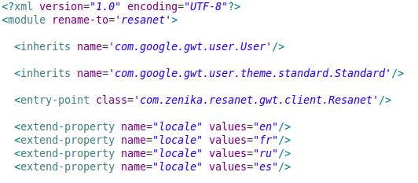
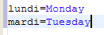
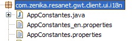
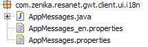

# Internationali-sation

<!-- .slide: class="page-title" -->


## i18nements

Notes :


## Présentation

- GWT fournit un mécanisme d'internationalisation - externalisation pour les constantes et les messages
- Une implémentation basée sur la notion de Locale (J2SE)
	- Des fichiers .properties encodés en UTF-8
- Mise en œuvre simple
	- Écriture d'un fichier .properties contenant les messages à externaliser
	- Mise en place d'une interface Java à partir de ce fichier
	- Utilisation de cette interface
	- Fonctionne en mode compilé et en mode développement
Notes :


## Configuration du module



Déclaration des locales gérées par l'application

```

```

Notes :


## Spécification de la locale

- Par ordre de résolution
	- Dans les paramètres de l'url HTTP
	- Dans les meta de la host page html
	- Dans le fichier de configuration du module GWThttp://127.0.0.1:8888/Resanet.html?locale=fr<metaname="gwt:property"content="locale=fr"><set-property-fallbackname="locale"value="fr">
Notes :


## Interface i18n

- Plusieurs interfaces existent en fonction du besoin
- com.google.gwt.i18n.client.Constants
	- Pour récupérer des messages fixes
- com.google.gwt.i18n.client.ConstantsWithLookup
	- Pour récupérer des messages associés à une clé
- com.google.gwt.i18n.client.Messages
	- Pour définir des messages paramétrables
Notes :


## Constants (1/2)

- L'interface doit se trouver dans le même package que les fichiers .properties
- ExemplepublicinterfaceAppConstantesextendscom.google.gwt.i18n.client.Constants {publicString lundi();publicString mardi();}






Notes :


## Constants (2/2)

- Récupération d'une constante dans le code client
- Si l'interface est une sous classe de ConstantsWithLookup, il est possible d'accéder aux valeurs via leur clé et la méthode getStringprivatestaticfinalAppConstantesCONSTANTES=GWT.create(AppConstantes.class);…String lundi =CONSTANTES.lundi();String lundi =CONSTANTES.getString("lundi");
Notes :


## Messages (1/2)

- L'interface doit se trouver dans le même package que les fichiers .properties
- ExemplepublicinterfaceAppMessagesextendscom.google.gwt.i18n.client.Messages {publicString messageA(String argA, String argB, String argC);}




Notes :


## Messages (2/2)

- Récupération d'un messages paramétré dans le code clientprivatefinal staticAppMessagesMESSAGES=GWT.create(AppMessages.class);…String message =MESSAGES.messageA(civilite, nom, application);
Notes :


## Internationaliser les nombres et les dates

- GWT fournit deux classes
	- DateTimeFormat
	- NumberFormat
- Permettent de formater les nombres et les dates en respectant les spécificités de la locale
Notes :


## Accéder aux informations de la locale

- Pour cela, GWT fournit la classe LocaleInfo
	- Connaitre la locale courante
	- Récupérer la liste des locales disponiblesif(LocaleInfo.getCurrentLocale().isRTL()) {...}for(String localeName : LocaleInfo.getAvailableLocaleNames()) {String name = LocaleInfo.getLocaleNativeDisplayName(localeName);...}
Notes :


## Aller plus loin

- Les formes plurielles
	- La grammaire d'un langage impose parfois d'avoir des messages différents selon une valeur d'un attribut numérique
	- Il suffit ensuite de définir les différents messages dans le fichier de properties
	- Plus d'informations dans la documentation de GWThttp://www.gwtproject.org/doc/latest/DevGuideI18nPluralForms.htmlpublic classAppMessagesextendsMessages {String cartItems(@PluralCountintitemCount);}cartItems=Votre panier contient {0,number} articles.cartItems[none]=Votre panier ne contient aucun article.cartItems[one]=Votre panier contient 1 article....
Notes :


## TP 7

Notes :


<!-- .slide: class="page-questions" -->


<!-- .slide: class="page-tp1" -->