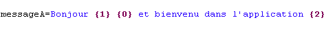

# Internationalisation

<!-- .slide: class="page-title" -->

Notes :


## Présentation

- GWT fournit un mécanisme d'internationalisation - externalisation pour les constantes et les messages
- Une implémentation basée sur la notion de Locale (J2SE)
	- Des fichiers `.properties` encodés en UTF-8
- Mise en œuvre simple
	- Écriture d'un fichier `.properties` contenant les messages à externaliser
	- Mise en place d'une interface Java à partir de ce fichier
	- Utilisation de cette interface
	- Fonctionne en mode compilé et en mode développement
Notes :


## Configuration du module

- Déclaration des locales gérées par l'application


Notes :


## Spécification de la locale

- Par ordre de résolution
	- Dans les paramètres de l'url HTTP
	<!-- .element: style="width: 110%;" -->
	```
	http://127.0.0.1:8888/Resanet.html?locale=fr
	```
	- Dans les meta de la host page html
	<!-- .element: style="width: 110%;" -->
	```
	<meta name="gwt:property" content="locale=fr">
	```
	- Dans le fichier de configuration du module GWT
	<!-- .element: style="width: 110%;" -->
	```
	<set-property-fallback name="locale" value="fr">
	```
Notes :


## Interface i18n

- Plusieurs interfaces existent en fonction du besoin
- `com.google.gwt.i18n.client.Constants`
	- Pour récupérer des messages fixes
- `com.google.gwt.i18n.client.ConstantsWithLookup`
	- Pour récupérer des messages associés à une clé
- `com.google.gwt.i18n.client.Messages`
	- Pour définir des messages paramétrables
Notes :


## Constants (1/2)

- L'interface doit se trouver dans le même package que les fichiers .properties

<figure style="display: block; float: left; margin: 30px 0; width: 40%">
    
</figure>

<figure style="display: block; float: left; margin: 30px 0; width: 40%">
    
</figure>

<!-- .element: style="clear: left;" -->
- Exemple

```
public interface AppConstantes 
	extends com.google.gwt.i18n.client.Constants {
	public String lundi();
	public String mardi();
}
```

Notes :


## Constants (2/2)

- Récupération d'une constante dans le code client

```java
private static final AppConstantes CONSTANTES = 
	GWT.create(AppConstantes.class);
...
String lundi = CONSTANTES.lundi();
```

- Si l'interface est une sous classe de `ConstantsWithLookup`, il est possible d'accéder aux valeurs via leur clé et la méthode `getString`

```java
String lundi = CONSTANTES.getString("lundi");
```
Notes :


## Messages (1/2)

- L'interface doit se trouver dans le même package que les fichiers `.properties`




- Exemple

```java
public interface AppMessages
	 extends com.google.gwt.i18n.client.Messages {
	public String messageA(String argA, String argB, String argC);
}
```

Notes :


## Messages (2/2)

- Récupération d'un message paramétré dans le code client

```java
private final static AppMessages MESSAGES = 
	GWT.create(AppMessages.class);
...
String message = MESSAGES.messageA(civilite, nom, application);
```

Notes :


## Internationaliser les nombres et les dates

- GWT fournit deux classes
	- `DateTimeFormat`
	- `NumberFormat`
- Permettent de formater les nombres et les dates en respectant les spécificités de la locale
Notes :


## Accéder aux informations de la locale

- Pour cela, GWT fournit la classe `LocaleInfo` pour connaitre la locale courante

```java
if(LocaleInfo.getCurrentLocale().isRTL())
{
	...
}
```

- Et récupérer la liste des locales disponibles

```java
for(String localeName : LocaleInfo.getAvailableLocaleNames()) {
	String name = 
		LocaleInfo.getLocaleNativeDisplayName(localeName);
	...
}
```

Notes :


## Aller plus loin

- Les formes plurielles
	- La grammaire d'un langage impose parfois d'avoir des messages différents selon une valeur d'un attribut numérique
	
	```java
		public class AppMessages extends Messages {
			String cartItems(@PluralCount int itemCount);
		}
	```

	- Il suffit ensuite définir les différents messages dans le fichier de properties
	```
		cartItems=Votre panier contient {0,number} articles.
		cartItems[none]=Votre panier ne contient aucun article.
		cartItems[one]=Votre panier contient 1 article...
	```

	- Plus d'informations dans la documentation de GWT http://www.gwtproject.org/doc/latest/DevGuideI18nPluralForms.html
	
Notes :


<!-- .slide: class="page-questions" -->


<!-- .slide: class="page-tp7" -->