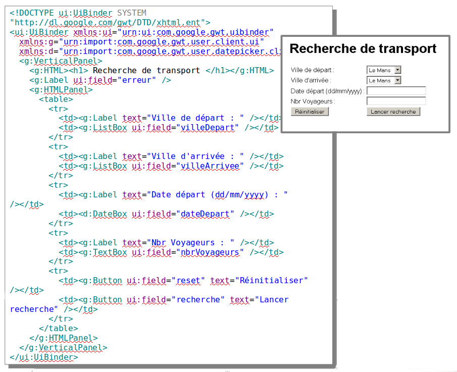
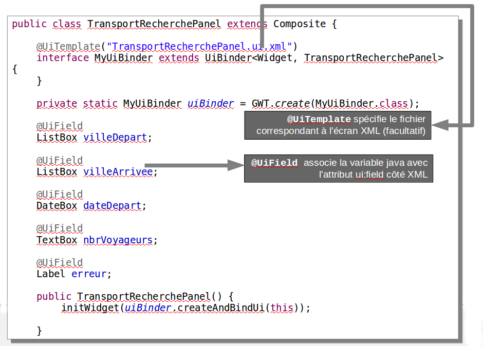

# UiBinder

<!-- .slide: class="page-title" -->

Notes :


## Présentation

- GWT permet d'écrire l'interface graphique d'une application web en Java, puis de la compiler vers du HTML et du JavaScript
- Cependant HTML et CSS restent les langages les plus naturels pour la mise en forme de pages web
- GWT 2.0 introduit le framework UIBinder
- L'idée
	- Création d'interfaces utilisateurs de manière déclarative
- Le principe
	- Déclaration de l'interface graphique dans un template XML
	- Implémentation de son comportement dans une classe Java
Notes :


## Présentation

- Augmente la productivité et maintenabilité
- Séparation entre la mise en forme en XML et l'implémentation de son comportement en Java
- Facilite la collaboration avec des designers qui sont plus à l'aise avec le HTML, XML et CSS
- S'appuie sur l'API ClientBundle pour la gestion des ressources et support du mécanisme d'internationalisation GWT
- A noter que UIBinder n'est pas une technologie de renderering.
	- Aucune balise pour effectuer des boucles, conditionnelles...etc
Notes :


## Mise en place : Template XML

- Déclaration de l'interface graphique dans un template XML

<figure>
    
</figure>

Notes :


## Mise en place : Classe Java

- Implémentation de son comportement dans une classe Java

<figure>
    
</figure>

Notes :


## Instanciation des composants (1/4)

- Par défaut, GWT utilise la méthode `GWT.create` pour instancier les composants UiBinder
- Il est possible de redéfinir ce comportement
	- En fournissant une instance de chaque composant
	- En définissant une factory de composant
- Cela est même parfois nécessaire
	- Widgets sans constructeurs par défaut
Notes :


## Instanciation des composants (2/4)

- Instancier chaque composant spécifiquement
	- Ajout de la propriété provided sur l'annotation @UiField

```java
	public class TransportRecherchePanel extends Composite {
		interface MyUiBinder extends UiBinder<Widget, TransportRecherchePanel> {}
		private static MyUiBinder uiBinder = GWT.create(MyUiBinder.class);
		@UiField(provided = true)
		Label monLabel;
		public TransportRecherchePanel() {
			monLabel = new Label("Mon Label");
			initWidget(uiBinder.createAndBindUi(this));
		}
	}
```

- Le widget doit être instancié avant l'appel à méthode `createAndBindUi`
	
Notes :


## Instanciation des composants (3/4)

- Utilisation de l'annotation @UiFactory

```java
@UiFactory
MyCustomWidget buildMyCustomWidgets() {
	return new MyCustomWidget(true);
}
```

- Le nom de la méthode n'a pas d'importance, GWT va se baser sur le type de retour
- Il est possible d'ajouter des paramètres à cette méthode. Chacun des paramètres devra être valorisé par l'ajout d'un attribut sur l'élément XML du widget correspondant.
Notes :


## Instanciation des composants (4/4)

- Dans le cas où le widget à instancier ne possède pas de constructeur sans paramètre, l'appel à la méthode `GWT.create()` est impossible.
- Il est bien sûr possible d'utiliser les méthodes précédentes (`provided=true`, `@UiFactory`)
- Une solution consiste à annoter un des constructeurs (non vide) du widget à instancier, les paramètres étant déclarés en xml

```java
@UiConstructor
public MyCustomWidget(boolean validate) {
	this.validate = validate;
}
```

```
<m:MyCustomWidget validate="true" />
```

Notes :


## Gestion des événements (1/2)

- Utilisation de l'annotation `@UiHandler` sur le widget déclaré par `ui:field`

```java
@UiHandler("reset")
public void onReset(ClickEvent event) {
	villeDepart.setSelectedIndex(0);
	villeArrivee.setSelectedIndex(0);
	dateDepart.setText("");
	nbrVoyageurs.setText("");
}
```

- Remarque : Pour déterminer le type de Handler à associer, UiBinder se base sur l'Event passé en paramètre → `ClickEvent` dans l'exemple

Notes :


## Gestion des événements (2/2)

- Il est possible d'associer plusieurs widgets à l'annotation `@UiHandler`

```java
@UiHandler({"reset1","reset2"})
public void onReset(ClickEvent event) {
	...
}
```

Notes :


## Gestion des styles (1/4)

- S'appuie sur l'API ClientBundle
- Les styles peuvent être
	- Embarqués dans le fichier XML
	- Définis dans un fichier css et être référencés depuis le fichier XML
	- Définis dans une interface de ressources de type ClientBundle
Notes :


## Gestion des styles (2/4)

- Embarquer les styles dans le fichier XML
	- Utilisation de la balise style<ui:style>
	- Référencement de la classe css avec une expression placée entre `{ }`

```
<! DOCTYPE ui:UiBinder SYSTEM
	"http://dl.google.com/gwt/DTD/xhtml.ent">
<ui:UiBinder xmlns:ui='urn:ui:com.google.gwt.uibinder'
		xmlns:g='urn:import:com.google.gwt.user.client.ui'>
	<ui:style>.rougeGras{font-weight:bold;color:red;}</ui:style>
	<g:VerticalPanel>
		<g:HTML>
			<h1>Recherche de transport</h1>
		</g:HTML>
		<g:Label styleName="{style.rougeGras}" ui:field="erreur"/>
	</g:VerticalPanel>
</ui:UiBinder>
```
Notes :


## Gestion des styles (3/4)

- Référencer un fichier CSS

```
<! DOCTYPE ui:UiBinder SYSTEM 
	"http://dl.google.com/gwt/DTD/xhtml.ent">
<ui:UiBinder xmlns:ui='urn:ui:com.google.gwt.uibinder' 
	xmlns:g='urn:import:com.google.gwt.user.client.ui'>
<ui:style src="mesStyles.css"/>
<g:VerticalPanel>
	<g:HTML>
		<h1>Recherche de transport</h1>
	</g:HTML>
	<g:Label styleName="{style.rougeGras}" ui:field="erreur"/>
</g:VerticalPanel>
</ui:UiBinder>

```

Notes :


## Gestion des styles (4/4)

- Utiliser une interface de ressources ClientBundle

```
<! DOCTYPEui:UiBinder SYSTEM         
		"http://dl.google.com/gwt/DTD/xhtml.ent">
<ui:UiBinder xmlns:ui='urn:ui:com.google.gwt.uibinder' 
		xmlns:g='urn:import:com.google.gwt.user.client.ui'>
<ui:with type="com.zenika.resanet.gwt.client.Resources"
		 field="res"/>
<g:VerticalPanel>
	<g:HTML><h1>Recherche de transport</h1></g:HTML>
	<g:Label styleName="{res.style.rougeGras}" ui:field="erreur"/>
</g:VerticalPanel>
</ui:UiBinder>
```

```java
public interface Resources extends ClientBundle {
	@Source("mesStyles.css") Style style();
	public interface Style extends CssResource {
		String rougeGras();
	}
}
```

Notes :


## Internationalisation

- Utilise le mécanisme d'internationalisation de GWT
- Il est possible d'appeler les dictionnaires existants via la notation `{dictionnaire.clé}`

```
<ui:with type="com.zenika.resanet.gwt.client.i18n.AppMessages" 
		field="cst"/>
…
<g:Label text="{cst.label_villeDepart}"/>
…
```
Notes :


## Quelques exemples (1/2)

```
<g:MenuBar>
	<g:MenuItem text="Utilisateur">
		<g:MenuBar vertical="true"> 
			<g:MenuItem ui:field="modifierItem">
				Modifier
			</g:MenuItem>
			<g:MenuItem ui:field="deconnecterItem">
				Se déconnecter
			</g:MenuItem>
		</g:MenuBar>
	</g:MenuItem>
	<g:MenuItem text="Voyages">
		<g:MenuBar vertical="true">
			<g:MenuItem ui:field="rechercherItem">
				Rechercher
			</g:MenuItem>
		</g:MenuBar>
	</g:MenuItem>
</g:MenuBar>
```

Notes :


## Quelques exemples (2/2)

```java
public class Menu extends Composite {
	private static MenuUiBinder uiBinder = 
			GWT.create(MenuUiBinder.class);
	interface MenuUiBinder extends UiBinder<Widget, Menu> {}
	@UiField
	MenuItem modifierItem;
	@UiField
	MenuItem deconnecterItem;
	@UiField 
	MenuItem rechercherItem;
	...
```
Notes : 


## Quelques exemples (1/2)

```
<g:DialogBox text="{constants.deconnect}">
	<g:FlowPanel>
		<g:Label text="{constants.confirmdeconnect}">
		</g:Label> 
		<g:FlowPanel>
			<g:Button ui:field="yesButton" text="{constants.yes}" 
				addStyleNames="{style.yesButton}"/>
			<g:Button ui:field="noButton" text="{constants.no}"
				addStyleNames="{style.noButton}"/>
		</g:FlowPanel>
	</g:FlowPanel>
</g:DialogBox>
```


## Quelques exemples (2/2)

```java
public class LogoutPopup extends DialogBox {
...
@UiHandler("yesButton")
public void handlerYesClick(ClickEvent event) {
	EcranPrincipal.EVENT_BUS.fireEvent(newLogoutEvent());
	LogoutPopup.this.hide();
}

@UiHandler("noButton")
public void handlerNoClick(ClickEvent event) {
	LogoutPopup.this.hide();
}
...
```
Notes :


<!-- .slide: class="page-questions" -->


<!-- .slide: class="page-tp8" -->