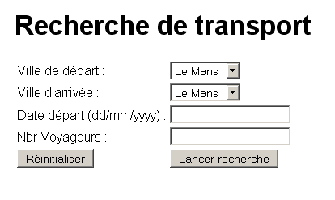

# UiBinder

<!-- .slide: class="page-title" -->

Notes :

## Présentation

- GWT permet d'écrire l'interface graphique d'une application web en Java, puis de la compiler vers du HTML et du JavaScript
- Cependant HTML et CSS restent les langages les plus naturels pour la mise en forme de pages web
- GWT 2.0 introduit le framework UIBinder
- L'idée
	- Création d'interfaces utilisateurs de manière déclarative
- Le principe
	- Déclaration de l'interface graphique dans un template XML
	- Implémentation de son comportement dans une classe Java
Notes :

## Présentation

- Augmente la productivité et maintenabilité
- Séparation entre la mise en forme en XML et l'implémentation de son comportement en Java
- Facilite la collaboration avec des designers qui sont plus à l'aise avec le HTML, XML et CSS
- S'appuie sur l'API ClientBundle pour la gestion des ressources et support du mécanisme d'internationalisation GWT
- A noter que UIBinder n'est pas une technologie de renderering.
	- Aucune balise pour effectuer des boucles, conditionnelles...etc
Notes :

## Mise en place : Template XML

- Déclaration de l'interface graphique dans un template XML<!DOCTYPE ui:UiBinderSYSTEM"http://dl.google.com/gwt/DTD/xhtml.ent"><ui:UiBinderxmlns:ui="urn:ui:com.google.gwt.uibinder"xmlns:g="urn:import:com.google.gwt.user.client.ui"xmlns:d="urn:import:com.google.gwt.user.datepicker.client"><g:VerticalPanel><g:HTML><h1>Recherche de transport</h1></g:HTML><g:Labelui:field="erreur"/><g:HTMLPanel><table><tr><td><g:Labeltext="Ville de départ : "/></td><td><g:ListBoxui:field="villeDepart"/></td></tr><tr><td><g:Labeltext="Ville d'arrivée : "/></td><td><g:ListBoxui:field="villeArrivee"/></td></tr><tr><td><g:Labeltext="Date départ (dd/mm/yyyy) : "/></td><td><d:DateBoxui:field="dateDepart"/></td></tr><tr><td><g:Labeltext="Nbr Voyageurs : "/></td><td><g:TextBoxui:field="nbrVoyageurs"/></td></tr><tr><td><g:Buttonui:field="reset"text="Réinitialiser"/></td><td><g:Buttonui:field="recherche"text="Lancer recherche"/></td></tr></table></g:HTMLPanel></g:VerticalPanel></ui:UiBinder>

Notes :

## Mise en place : Classe Java

- Implémentation de son comportement dans une classe JavapublicclassTransportRecherchePanelextendsComposite {@UiTemplate("TransportRecherchePanel.ui.xml")interfaceMyUiBinderextendsUiBinder<Widget, TransportRecherchePanel> {}privatestaticMyUiBinderuiBinder= GWT.create(MyUiBinder.class);@UiFieldListBoxvilleDepart;@UiFieldListBoxvilleArrivee;@UiFieldDateBoxdateDepart;@UiFieldTextBoxnbrVoyageurs;@UiFieldLabelerreur;publicTransportRecherchePanel() {initWidget(uiBinder.createAndBindUi(this));}@UiFieldassocie la variable java avec l'attribut ui:field côté XML@UiTemplatespécifie le fichier correspondant à l'écran XML (facultatif)
Notes :

## Instanciation des composants (1/4)

- Par défaut, GWT utilise la méthode GWT.create pour instancier les composants UiBinder
- Il est possible de redéfinir ce comportement
	- En fournissant une instance de chaque composant
	- En définissant une factory de composant
- Cela est même parfois nécessaire
	- Widgets sans constructeurs par défaut
Notes :

## Instanciation des composants (2/4)

- Instancier chaque composant spécifiquement
	- Ajout de la propriété provided sur l'annotation @UiField
	- Le widget doit être instancié avant l'appel à méthode createAndBindUipublicclassTransportRecherchePanelextendsComposite {interfaceMyUiBinderextendsUiBinder<Widget, TransportRecherchePanel> {}privatestaticMyUiBinderuiBinder= GWT.create(MyUiBinder.class);@UiField(provided =true)LabelmonLabel;publicTransportRecherchePanel() {monLabel=newLabel("Mon Label");initWidget(uiBinder.createAndBindUi(this));}}
Notes :

## Instanciation des composants (3/4)

- Utilisation de l'annotation @UiFactory
- Le nom de la méthode n'a pas d'importance, GWT va se baser sur le type de retour
- Il est possible d'ajouter des paramètres à cette méthode. Chacun des paramètres devra être valorisé par l'ajout d'un attribut sur l'élément XML du widget correspondant.@UiFactoryMyCustomWidget buildMyCustomWidgets(){return newMyCustomWidget(true);}
Notes :

## Instanciation des composants (4/4)

- Dans le cas où le widget à instancier ne possède pas de constructeur sans paramètre, l'appel à la méthode GWT.create() est impossible.
- Il est bien sûr possible d'utiliser les méthodes précédentes (provided=true, @UiFactory)
- Une solution consiste à annoter un des constructeurs (non vide) du widget à instancier, les paramètres étant déclarés en xml@UiConstructorpublicMyCustomWidget(booleanvalidate) {this.validate= validate;}<m:MyCustomWidgetvalidate="true"/>
Notes :

## Gestion des événements

- Utilisation de l'annotation @UiHandler sur le widget déclaré par ui:field
- Remarque : Pour déterminer le type de Handler à associer, UiBinder se base sur l'Event passé en paramètre → ClickEvent dans l'exemple
- Il est possible d'associer plusieurs widgets à l'annotation @UiHandler@UiHandler("reset")publicvoidonReset(ClickEvent event) {villeDepart.setSelectedIndex(0);villeArrivee.setSelectedIndex(0);dateDepart.setText("");nbrVoyageurs.setText("");}@UiHandler({"reset1","reset2"})publicvoidonReset(ClickEvent event) {...}
Notes :

## Gestion des styles (1/4)

- S'appuie sur l'API ClientBundle
- Les styles peuvent être
	- Embarqués dans le fichier XML
	- Définis dans un fichier css et être référencés depuis le fichier XML
	- Définis dans une interface de ressources de type ClientBundle
Notes :

## Gestion des styles (2/4)

- Embarquer les styles dans le fichier XML
	- Utilisation de la balise style<ui:style>
	- Référencement de la classe css avec une expression placée entre { }<!DOCTYPEui:UiBinderSYSTEM"http://dl.google.com/gwt/DTD/xhtml.ent"><ui:UiBinderxmlns:ui='urn:ui:com.google.gwt.uibinder'xmlns:g='urn:import:com.google.gwt.user.client.ui'><ui:style>.rougeGras{font-weight:bold;color:red;}</ui:style><g:VerticalPanel><g:HTML><h1>Recherche de transport</h1></g:HTML><g:LabelstyleName="{style.rougeGras}"ui:field="erreur"/></g:VerticalPanel></ui:UiBinder>
Notes :

## Gestion des styles (3/4)

- Référencer un fichier CSS<!DOCTYPEui:UiBinderSYSTEM"http://dl.google.com/gwt/DTD/xhtml.ent"><ui:UiBinderxmlns:ui='urn:ui:com.google.gwt.uibinder'xmlns:g='urn:import:com.google.gwt.user.client.ui'><ui:stylesrc="mesStyles.css"/><g:VerticalPanel><g:HTML><h1>Recherche de transport</h1></g:HTML><g:LabelstyleName="{style.rougeGras}"ui:field="erreur"/></g:VerticalPanel></ui:UiBinder>
Notes :

## Gestion des styles (4/4)

- Utiliser une interface de ressources ClientBundle<!DOCTYPEui:UiBinderSYSTEM"http://dl.google.com/gwt/DTD/xhtml.ent"><ui:UiBinderxmlns:ui='urn:ui:com.google.gwt.uibinder'xmlns:g='urn:import:com.google.gwt.user.client.ui'><ui:withtype="com.zenika.resanet.gwt.client.Resources"field="res"/><g:VerticalPanel><g:HTML><h1>Recherche de transport</h1></g:HTML><g:LabelstyleName="{res.style.rougeGras}"ui:field="erreur"/></g:VerticalPanel></ui:UiBinder>public interfaceResourcesextendsClientBundle {@Source("mesStyles.css")Style style();public interfaceStyleextendsCssResource {String rougeGras();}}
Notes :

## Internationalisation

- Utilise le mécanisme d'internationalisation de GWT
- Il est possible d'appeler les dictionnaires existants via la notation {dictionnaire.clé}<ui:withtype="com.zenika.resanet.gwt.client.i18n.AppMessages"field="cst"/>…<g:Labeltext="{cst.label_villeDepart}"/>…
Notes :

## Quelques exemples (1/2)
<g:MenuBar><g:MenuItemtext="Utilisateur"><g:MenuBarvertical="true"><g:MenuItemui:field="modifierItem">Modifier</g:MenuItem><g:MenuItemui:field="deconnecterItem">Se déconnecter</g:MenuItem></g:MenuBar></g:MenuItem><g:MenuItemtext="Voyages"><g:MenuBarvertical="true"><g:MenuItemui:field="rechercherItem">Rechercher</g:MenuItem></g:MenuBar></g:MenuItem></g:MenuBar>publicclassMenuextendsComposite {privatestaticMenuUiBinderuiBinder= GWT.create(MenuUiBinder.class);interfaceMenuUiBinderextendsUiBinder<Widget, Menu> {}@UiFieldMenuItemmodifierItem;@UiFieldMenuItemdeconnecterItem;@UiFieldMenuItemrechercherItem;
Notes :

## Quelques exemples (2/2)
<g:DialogBoxtext="{constants.deconnect}"><g:FlowPanel><g:Labeltext="{constants.confirmdeconnect}"></g:Label><g:FlowPanel><g:Buttonui:field="yesButton"text="{constants.yes}"addStyleNames="{style.yesButton}"/><g:Buttonui:field="noButton"text="{constants.no}"addStyleNames="{style.noButton}"/></g:FlowPanel></g:FlowPanel></g:DialogBox>publicclassLogoutPopupextendsDialogBox {...@UiHandler("yesButton")publicvoidhandlerYesClick(ClickEvent event) {EcranPrincipal.EVENT_BUS.fireEvent(newLogoutEvent());LogoutPopup.this.hide();}@UiHandler("noButton")publicvoidhandlerNoClick(ClickEvent event) {LogoutPopup.this.hide();}
Notes :

## TP 8

Notes :

<!-- .slide: class="page-questions" -->

<!-- .slide: class="page-tp1" -->