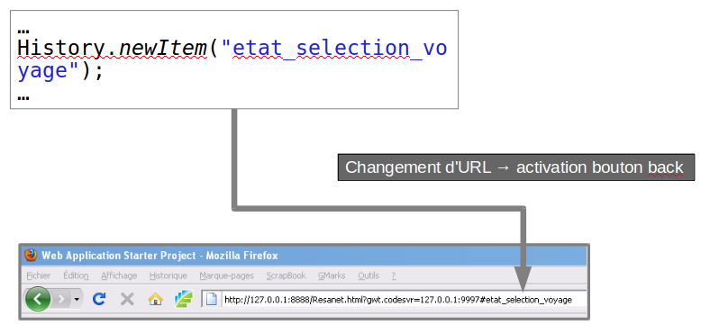
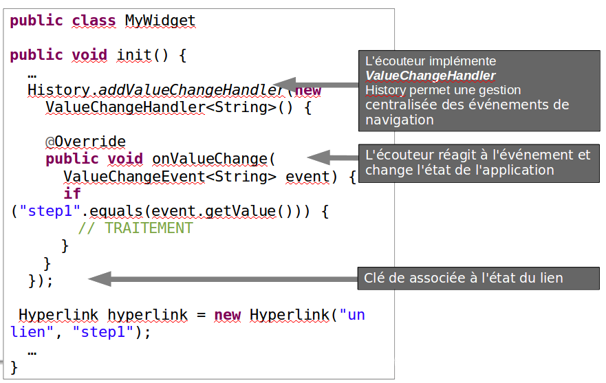
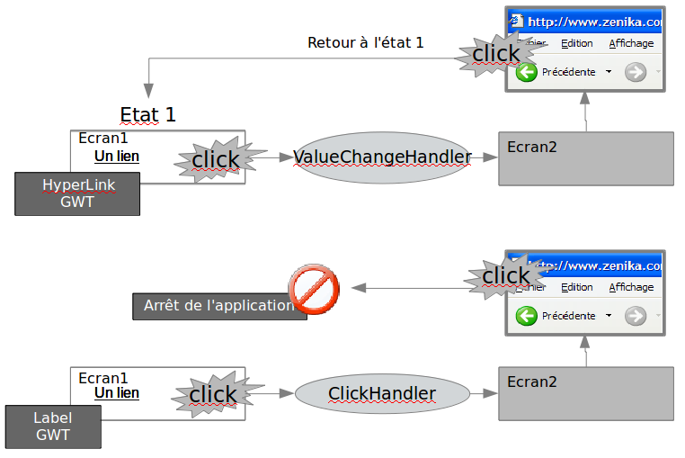

# Gestion de l'historique

<!-- .slide: class="page-title" -->


Notes :


## Rappels

- GWT Fonctionne en mode«SinglePageInterface » (SPI)
- Cela implique que le « passage » d'un écran à un autre ne modifie pas l'URL de la page.
- Il faut donc trouver des contournements afin de conserver l'ergonomie de l'interface
Notes :


## Ergonomie et navigateur

- Habitudes de l'utilisateur après une action effectuée
	- Passage à l'étape précédente par bouton du navigateur
- Impact sur l'utilisation d'une application GWT


- Conséquence : nécessité de prendre en charge l'utilisation des boutons browser
	- Notion d'historique
	- Utilisation de la classe History


Notes :


## Gestion de l'historique

- GWT fournit la classe History qui permet de prendre la main sur les fonctions back/forward du navigateur
```java
public static void newItem(String historyToken)
```
- Change l'état courant → enregistre une URL spécifique dans l'historique du navigateur
```java
public static void back()
```
- Invoque programmatiquement la fonction back du navigateur
```java
public static void forward()
```
- Invoque programmatiquement la fonction forward du navigateur
```java
public static String getToken()
```
- Récupère le jeton associé à l'état courant


Notes :


## Enregistrement d'un état



Notes :


## Listener Historique (1/2)

- La classe History ne gére que des tokens → l'état global de l'application n'est pas pris en charge
- Les changements d'état de l'application suite à l'utilisation des boutons back/forward doivent être pris en charge par le développeur
- Il est nécessaire de mettre en place un ou plusieurs listeners d'historique afin de mettre en œuvre la gestion d'historique
	- L'activation des boutons back/forward déclenche un appel à la méthode onValueChange(...) du listener → il est possible de gérer le changement d'état
Notes :


## Listener Historique (2/2)

```java
History.addValueChangeHandler(
	new ValueChangeHandler<String>() {
		@Override
		public void onValueChange(ValueChangeEvent<String> event) {
			if (event.getValue().equals("etat_selection_voyage")) {
				... // affichage ecran selection voyage
			}else if(event.getValue()
				.equals("etat_infos_utilisateur") {
			 ...// affichage ecran infos utilisateur
		}else{
		…
	}
}
});…

```

- Remarque : l'appel àHistory.newItem(token)déclenche également un appel à la méthode onValueChange(...) → il est possible d'empêcher ce comportement en utilisant la méthodeHistory.newItem(token,false)
Notes :


## HyperLink (1/2)

- Le widget HyperLink crée un lien interne associé à un état interne de l'application géré par l'historique (boutons Back & Next du navigateur)

<figure>
    
</figure>


Notes :


## HyperLink (2/2)

- Différence de comportement entre l'utilisation d'un HyperLink et d'un Label cliquable


<figure>
    
</figure>


Notes :


<!-- .slide: class="page-questions" -->


<!-- .slide: class="page-tp9" -->