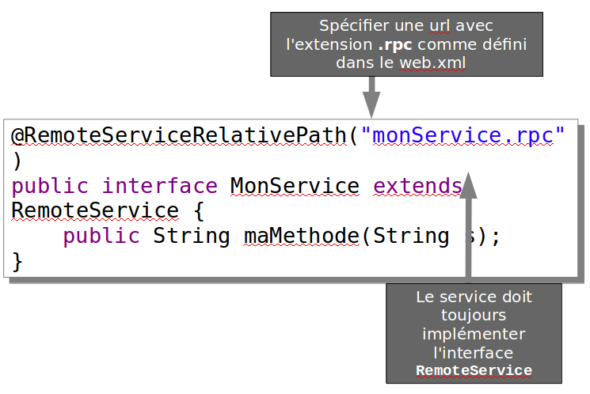

# Intégration Java EE

<!-- .slide: class="page-title" -->

Notes :


## Intégration Maven

- Maven est système de build, standard du marché
	- Un outil de construction et de déploiement
	- Un gestionnaire de dépendance des librairies d'un projet
	- Un outil de reporting des métriques
	- Un outil de gestion du cycle de construction du projet
- Maven est un système complet gérant le projet informatique
	- Fourniture d'un ensemble de conventions et de standards
	- Fourniture d'un cycle de vie
	- Traitement natif du reporting et de la qualité de code
Notes :


## Intégration Maven

- Le plugin gwt-maven-plugin
- Téléchargeable à l'adresse suivante :http://mojo.codehaus.org/gwt-maven-plugin/
- Le plug-in permet :
	- D'invoquer le compilateur GWT
	- De déboguer une application GWT en mode Hosted
	- D'exécuter les tests unitaires GWT
	- Générer les classes des services asynchrones et d'internationalisation
Notes :


## Intégration Spring - Introduction

- La librairie GwtRpc-Spring offre une intégration simple de Spring avec GWT 1.6.x et plus.
- Téléchargeable à l'adresse suivante :http://code.google.com/p/gwtrpc-spring/
- GwtRpc-Spring fournit un `RemoteServiceDispatcher` qui intercepte les requêtes RPC du client et cherche dans le contexte Spring une classe implémentant le service demandé.
	- Plus besoin de déclarer une servlet par service.
	- Les implémentations de services n'ont plus besoin d'hériter de `RemoteServiceServlet`.
	- Tout POJO Spring peut devenir un service RPC
Notes :


## Intégration Spring – Mise en œuvre (1/5)

- Éditer le fichier `web.xml`
	- Déclaration du `ContextLoaderListener` de Spring
	```xml
	<listener>
		<listener-class>
		org.springframework.web.context.ContextLoaderListener
		</listener-class>
	</listener>
	```
	- Déclaration d'une servlet unique, ayant le rôle de front controller
	```
	<servlet>
		<servlet-name>dispatcher</servlet-name>
		<servlet-class>org.gwtrpcspring.RemoteServiceDispatcher</servlet-class>
	</servlet>
	```

Notes :


## Intégration Spring – Mise en œuvre (2/5)

- Éditer le fichier `web.xml`  
	- Mapping de la servlet sur toutes les url de type `*.rpc`

	```
		<servlet-mapping>
			<servlet-name>dispatcher</servlet-name>
			<url-pattern>*.rpc</url-pattern>
		</servlet-mapping>
	```

Notes : 


## Intégration Spring – Mise en œuvre (3/5)

- L'interface du service


Notes :


## Intégration Spring – Mise en œuvre (4/5)

- L'implémentation du service
	- Tout bean Spring peut être exposé via l’annotation `@Service`. Avec l'annotation il n'est plus nécessaire de déclarer le bean dans le fichier xml de Spring
	- L'implémentation du service n'a plus besoin d'hériter de la classe `RemoteServiceServlet`

```java
	@Service
	public class MonServiceImpl implements MonService {
		public String maMethode(String s){
			return"Bonjour tout le monde";
		}
	}
```	
Notes :


## Intégration Spring – Mise en œuvre (5/5)

- Le fichier de configuration Spring
	- Spring avec annotations
	```
	<?xmlversion="1.0"encoding="UTF-8"?>
	<beans…>
		<context:annotation-config/>
		<context:component-scanbase-package="com.zenika.xxx.server"/>
	</beans>
	```
	- Spring sans annotations
	```
	<?xmlversion="1.0"encoding="UTF-8"?>
	<beans…>
		<bean id="monService"class="com.zenika.xxxx.MonServiceImpl"/>
	</beans>
	```
- Une fois configurés, tous les appels sur les urls se terminant par `*.rpc` seront « dispatchés » vers le bean Spring correspondant.
Notes :


<!-- .slide: class="page-questions" -->