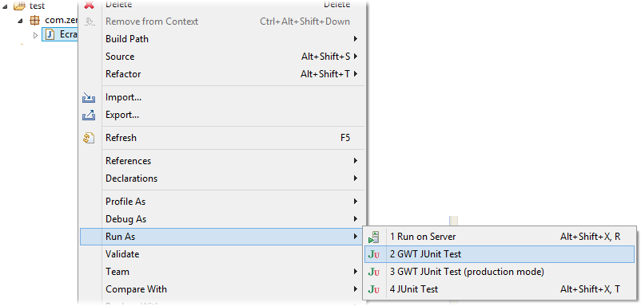

# Tests

<!-- .slide: class="page-title" -->

Notes :


## Pourquoi tester en GWT

- Pour permettre à l'utilisateur de gagné en fluidité dans l'utilisation de notre application, nous allons réaliser de la logique métier coté client sans faire d'appels au serveur.
- Il est nous faut assurer la qualité de notre application lors de ses évolutions. Seul le test pourra nous assurer que les traitements métier seront correctement réalisés dans tout le cycle de vie de l'application.
- Attention: Les traitements métier réalisés sur le poste client doivent parfois être réalisés aussi sur le serveur (exemple : calcul du montant d'un panier d'achat)
Notes :


## Comment tester

- Il est possible de tester une application GWT sur 2 niveaux
	- Tester unitairement des traitements métier.
		- Il faut structurer son code pour isoler le traitement métier de la gestion de l'interface.
		- Cela force à découper son code de manière optimum.
	- Lancer des scénarios de navigation puis contrôler des champs directement dans l'interface.
		- Permet de valider l'ensemble de l'application
		- La réalisation et la maintenance des scénarios de test est plus complexe
Notes :


## Test Unitaire – GWTTestCase (1/3)

- Les tests se définissent dans un répertoire « test » situé au même niveau que le répertoire « src » du projet.
- La classe doit se situer dans le package client et étendre `GWTTestCase`.
- Il faut alors implémenter `getModuleName` et retourner l'emplacement du `module.gwt.xml` (pour notre application `com.zenika.resanet.gwt.Resanet`)
- La librairie JUnit doit être présente dans le classpath pour pouvoir exécuter les tests.
- La convention veut que les méthodes de test de la classe commence par `test`.
- Il est alors possible de tester les résultats avec les méthodes `assert*`
Notes :


## Test Unitaire – GWTTestCase (2/3)

- Pour lancer le test, faire un clique droit sur la classe puis dans la section « Run As », lancer « GWT Junit Test »



Notes :


## Scénario de test – HTMLUnit (1/4)

- http://htmlunit.sourceforge.net/
- Il s'agit de définir puis de dérouler un scénario de test puis de vérifier l'état d’élément de la page web.
- HTMLUnit va simuler un navigateur, qu'il est possible de configurer.
- Il s'agit alors de définir la page que doit accéder ce navigateur puis de récupérer des éléments de la page et d’interagir avec.
- Il faut qu'un serveur soit démarré pour tester.
Notes :


## Scénario de test - HTMLUnit (2/4)

- Se compose d'un ensemble de librairies à installer dans notre application
- Le test sera un test Java classique
- Le package est libre
- La classe doit étendre `TestCase`
- La convention veut que les méthodes de test de la classe commence par `test`
- Pour lancer le test, faire un clique droit sur la classe puis dans la section « Run As », lancer « JUnit Test »
Notes :


## Scénario de test - HTMLUnit (3/4)

- Le navigateur
	```java
	WebClient webClient = new WebClient();
	```
- Accéder à une page
	```java
	HtmlPage page = webClient.getPage("http://.../");
	```
- Attendre que le JavaScript GWT soit en place
	```java
	webClient.waitForBackgroundJavaScript(5000);
	```
- Récupérer un élément
	```java
	page.getElementById("...");
	```
	- Retourne des objets : `HtmlTextInput`, `HtmlPasswordInput`...
	- Possibilité d'appeler : `setText()`, `click()`

Notes :


## Scénario de test - HTMLUnit (4/4)

- Pour mettre en place une écoute des messages d'alerte
- A définir avant de charger la page

```java
	List<String> collectedAlerts = new ArrayList<String>();
	webClient.setAlertHandler(
		new CollectingAlertHandler(collectedAlerts));
```

- Contrôler le contenu de la liste des messages d'alerte

```java
	List<String> expectedAlerts =
		 Collections.singletonList("...");
	Assert.assertEquals(expectedAlerts, collectedAlerts);
```

Notes :


<!-- .slide: class="page-questions" -->


<!-- .slide: class="page-tp10" -->