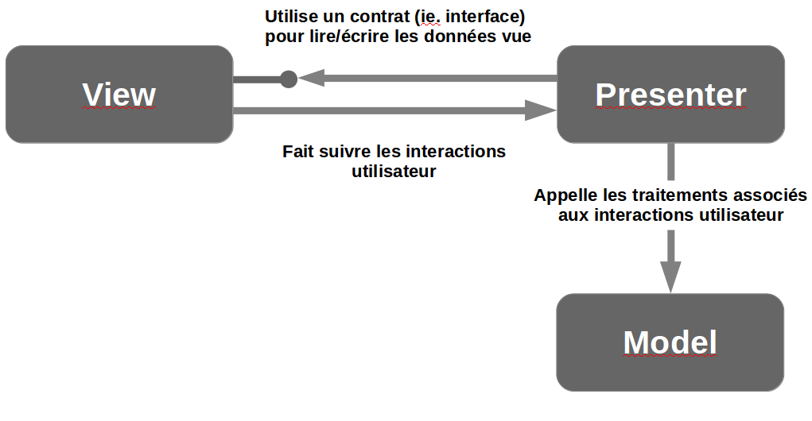

# Notions avancées
<!-- .slide: class="page-title" -->

Notes :


# Traitements longs
<!-- .slide: class="page-title" -->

Notes :


## Traitements longs et planification

- Javascript ne permet pas de lancer des processus/threads parallèles
- Tout traitement monopolise le navigateur → tout traitement long va «&nbsp;geler&nbsp;» le navigateur/application jusqu'à ce qu'il se termine.
- C'est pour cela que GWT et l'ensemble des frameworks AJAX s'appuient sur `XMLHttpRequest` pour gérer les appels serveurs → le temps qu'une requête soit traitée coté serveur, le code Javascript non lié à la requête peut s'exécuter.
- GWT fournit plusieurs outils permettant de mettre en œuvre des traitements long
Notes :


## Timer (1/2)

- La classe `Timer` permet de planifier ou de répéter à interval régulier un traitement donné
- Il s'agit de l'équivalent de la classe Java `java.util.Timer`
- Afin de mettre en place un Timer, il est nécessaire
	- de créer une sous-classe de `Timer`
	- de redéfinir la méthode `run()` → traitement à effectuer
- Un Timer fournit deux méthodes d'exécution
	- `schedule(int delayMillis)` : permet de planifier l'exécution dutraitement dans n millisecondes
	- `scheduleRepeating(int)` : permet d'exécuter le traitement toutes les n millisecondes
Notes :


## Timer (2/2)

```java
package com.zenika.gwt.client;
…
public class Test implements EntryPoint {
	public void onModuleLoad() {
		Timer timer = new ExempleTimer();
		timer.schedule(10000);
	}
	private static class ExempleTimer extends Timer {
		private long temps = System.currentTimeMillis();
		@Override
		public void run() {
			temps = System.currentTimeMillis() - temps;
			Window.alert("Il s'est écoulé "+ temps / 1000 
				+" secondes");
		}
	}
}
```

<figure style="position: absolute; bottom: 30px; right: 0;">
    
</figure>


Notes :


## Scheduler (1/3)

- La classe `Scheduler` fournit plusieurs méthodes permettant de planifier des traitements
	- Au début/fin de la tâche en cours
	- Une fois que tous les évènements en cours ont été traités
	- Après un délai/période fixée
- Scheduler fournit également une méthode `scheduleIncremental` prenant en paramètre un objet `RepeatingCommand`


Notes :


## Scheduler (2/3)

- La commande incrémentale permet d'exécuter un traitement à interval régulier jusqu'à la vérification d'une condition donnée
	- cela permet de fragmenter un traitement long afin de ne pas geler l'application
- L'exemple classique de mise en œuvre d'une commande incrémentale est le remplissage d'une liste
	- Dans le cas où le nombre de lignes est volumineux, le temps d'affichage peut être relativement long (ie. plusieurs secondes)
	- Le fait de fragmenter le remplissage permet d'afficher le contenu de la liste au fur et à mesure (pas d'effet page blanche)
Notes :


## Scheduler (3/3)

```java
packagecom.zenika.gwt.client;
…
public class Test implements EntryPoint {
	public void onModuleLoad() {
		final VerticalPanel panel = new VerticalPanel();
		RootLayoutPanel.get().add(panel);
		Scheduler.get().scheduleIncremental(
			new RepeatingCommand() {
				private int index = 0;
				@Override
				public boolean execute() {
					panel.add(newLabel("Label "+ ++index));
					// si la limite est non atteinte
					// on continue le traitement
					returnindex< 1000;
				}
			});
		}
	}
```

<figure style="position: absolute; bottom: 80px; right: 30px;">
    
</figure>


Notes :


# API ClientBundle
<!-- .slide: class="page-title" -->
Notes :


## L'API ClientBundle (1/3)

- Une application web manipule potentiellement de nombreuses ressources (Images, CSS, fichiers texte...etc)
- Sans politique de cache bien définie, l'accès à chaque ressource va nécessiter un téléchargement au préalable
- Tout ceci peut nuire aux performances de chargement des pages
Notes :


## L'API ClientBundle (2/3)

- GWT 2.0 introduit l'API ClientBundle pour une meilleure gestion des ressources
- L'idée est de
	- Bénéficier de la mise en cache permanente des ressources
	- Pouvoir définir quand une ressource doit être chargée : au démarrage ou seulement à la demande
	- Pouvoir définir un traitement particulier pour certaines ressources
	- Éviter de multiples téléchargement d'une même ressource lorsqu'elle est référencée sur différentes pages
Notes :


## L'API ClientBundle (3/3)

- Les différents types de ressources
	- `TextResource`
	- `ExternalTextResource` : récupération d'une ressource textuelle en mode asynchrone
	- `DataResource` : récupération de ressources binaires (PDF, DOC) via un lien hypertexte
	- `ImageResource`
	- `CssResource`
- Module à importer
	
	 ```<inherits name="com.google.gwt.resources.Resources" />```
Notes :


# Code Splitting
<!-- .slide: class="page-title" -->
Notes :


## Code Splitting (1/4)

- GWT 1.x → le compilateur génère un fichier Javascript monolithique
- Selon la taille de l'application finale, le fichier généré peut atteindre plusieurs Mo
- Dégradation du temps de chargement initial, téléchargement et initialisation de l'application
Notes :


## Code Splitting (2/4)

- GWT 2.0 introduit le mécanisme de chargement à la demande appelé aussi Code Splitting
- L'idée
	- Optimiser le chargement initial de son application
	- Fragmentation du fichier Javascript monolithique en plaçant manuellement des points de rupture
	- Chargement à la demande de fragments de code Javascript
- Le principe
	- Utilisation de l'instruction `GWT.runAsync()` pour définir les points de rupture
Notes :


## Code Splitting (3/4)

- Les différents types de fragments
	- Un fragment initial identifié par le fichier `<md5Key>.cache.html` et contient le code nécessaire au chargement initial de l'application
	- Des fragments exclusifs contient le code Javascript défini dans les points de rupture
	- Un fragment partagé contient le code partagé par les fragments exclusifs
- Remarque : Les fragments sont générés dans un répertoire `deferredjs` avec comme extension `<chiffre>.cache.js`
Notes :


## Code Splitting (4/4)

- Placer un point de rupture avec l'intruction `GWT.runAsync()`


Notes :


<!-- .slide: class="page-tp11" -->


Notes :


# JSNI
<!-- .slide: class="page-title" -->

Notes :


## Le besoin (1/2)

- GWT permet de générer des bibliothèques JavaScript à partir du code Java
- Il peut paraître étonnant de devoir/vouloir écrire du code Javascript dans GWT vu que ce dernier nous permet de nous en abstraire et d'éviter les problèmes inhérents au Javascript
	- Fuite mémoire
	- Compatibilité inter-navigateurs
	- Productivité des développements
	- …
Notes :


## Le besoin (2/2)

- Dans certains cas, il est nécessaire d'avoir le contrôle sur l'écriture de ce code natif et de pouvoir interagir avec celui-ci via du code Java
	- Implémenter des comportements de bas niveau non intégrés par défaut par les widgets GWT fournies
	- Intégrer des routines de librairies JavaScript existantes dans des widgets GWT afin de permettre des effets visuels plus aboutis
		- Dojo, Scriptaculous, Simple JS, JQuery
		- Drag and Drop
		- Transparences
Notes :


## La solution GWT

- La solution : JavaScript Native Interface (JSNI)
	- Solution inspirée de JNI (J2SE), le mécanisme d'appel de code natif
- Principes
	- Écriture de méthode Java déclarée "native" dont l'implémentation est écrite en JavaScript
	- Correspondance entre les paramètres d'E/S (Java) et les variables (JavaScript) internes à la méthode
	- A la compilation GWT, le code Javascript est « presque » retranscrit tel que
Notes :


## Restrictions et avertissements (1/2)

- Mécanisme puissant qui permet d'avoir un contrôle total sur un comportement donné
- Inconvénient : le code JavaScript est moins homogène et moins portable que le code généré lors de la compilation
	- Rappel : GWT assure par défaut une non-adhérence et fonctionnement robuste sur la plupart des navigateurs
	- Risque de fuite mémoire

Notes :


## Restrictions et avertissements (2/2)

- Conclusion
	- A utiliser avec parcimonie
	- Choisir le bon design du composant final (type, composition, interface)
	- Faire des tests poussés du code (JavaScript) intégré

Notes :


## Écriture d'une méthode native (1/2)

- JSNI = JavaScript and Native Interface
- JSNI s'appuie sur la syntaxe JNI (Java Native Interface) qui permet à Java d'intégrer du code natif → mot clé `native`
- Méthode JSNI

```java
…
public native void alert(String msg)/*-{
	// Code Javascript
	$wnd.alert(msg);
}-*/;
…
```


## Écriture d'une méthode native (2/2)

- Remarques
	- les commentaires sont une astuce permettant au compilateur/IDE de ne pas détecter d'erreurs
	- GWT fournit les variables `$wnd` et `$doc` (ie. objets HTML window et document)

Notes :


## Appeler du code Java depuis Javascript

- Accéder à du code Java depuis Javascript permet notamment à l'application de réagir à des événements Javascript
	- Exemple : réagir à un clic sur une carte Google Maps
- Afin d'intégrer un appel Java, il est nécessaire d'utiliser une syntaxe spécifique

```
[instance-expr.]@class-name::method-name(param-
signature)(arguments)
```

```java
public void infos(String message) {
	…
}
public native void afficherInfos(String msg)/*-{
	this.@com.zenika.gwt.Presenter::infos(Ljava/lang/String;)(msg)
}-*/;
```

Notes :


## Signature JSNI

- La description des arguments Java s'appuie sur la syntaxe JNI de signature de méthode
- Il est nécessaire de décrire la méthode Java avec la syntaxe JNI
- Il est important de décrire l'ensemble des informations pour permettre au compilateur de connaître précisément la méthode à appeler (exemple : surcharge de méthode)
- Exemple : Ljava/lang/String  String

```
this.@com.zenika.gwt.Presenter::infos(Ljava/lang/String;)(msg)
```
Notes :


## Exceptions dans JSNI

- Les exceptions générées par exécution du code JavaScript sont wrappées par une `JavaScriptException`
- En pratique, cela n'est pas recommandé
- Il est préférable d'utiliser un bloc try-catch en JavaScript
Notes :


<!-- .slide: class="page-tp12" -->


# Pattern MVP
<!-- .slide: class="page-title" -->

Notes :


## Bonnes pratiques GWT (1/2)

- Une conférence du Google I/O 2009 présentée par Ray Ryan a mis en avant les bonnes pratiques d'architecture GWT
	- Couplage faible
	- Pattern MVP
	- Pattern Command
	- Concept d'EventBus
	- Injection de dépendances

Notes :


## Bonnes pratiques GWT (2/2)

- Cette conférence a été fortement commentée et de nombreux effets se sont fait sentir
	- Prise de conscience de la nécessaire formalisation et industrialisation des développements GWT
	- Développement de projets et frameworks autour des concepts mis en avant


## MVC


Notes :


## MVP



Notes :


## Pourquoi MVP ? (1/2)

- Comparé à MVC, MVP réduit le rôle View au strict minimum
	- View dans MVP = Passive View
	- Aucune logique n'est mise en œuvre par la vue

- La View dans MVC, même faiblement, est couplée au Model et au Controler avec pour conséquences :

	- Logique graphique (ie. interactions utilisateur) difficilement testable
	- Difficile à maintenir et faire évoluer

Notes :


## Pourquoi MVP ? (2/2)

- Le Presenter définit une interface de liaison (ie. contrat) avec la View

- Le couplage faible entre Presenter et View assure une évolution optimale de l'ensemble du système

- Il est également possible pour des View complexes d'utiliser plusieurs Presenter afin d'assurer la lisibilité des développements

- L'adjonction d'un EventBus permet de mettre en œuvre une modularité forte de l'application


## Quelques exemples

<pre style="border: 1px solid #b30c37;border-left: 5px solid #b30c37;width: 100%;">
<code class="java">
<g:DialogBoxtext="{constants.deconnect}">
	<g:FlowPanel>
		<g:Label text="{constants.confirmdeconnect}"></g:Label>
		<g:FlowPanel>
			<g:Button ui:field="yesButton"text="{constants.yes}" 
				addStyleNames="{style.yesButton}"/>
			<g:Button ui:field="noButton"text="{constants.no}"
				addStyleNames="{style.noButton}"/>
		</g:FlowPanel>
	</g:FlowPanel>
</g:DialogBox>
</code>
</pre>

```java
public class LogoutPopup extends DialogBox {
	@UiHandler("yesButton")
	public void handlerYesClick(ClickEvent event) {
		EcranPrincipal.EVENT_BUS.fireEvent(new LogoutEvent());
		LogoutPopup.this.hide();
	}
	@UiHandler("noButton")
	public void handlerNoClick(ClickEvent event) {
		LogoutPopup.this.hide();
	}

```
Notes :


## Pour aller plus loin (1/2)

- Possibilité de mettre en place un moteur d'injection de dépendances
	- View → Presenter
	- EventBus → Presenter
- Moteur d'injection de dépendances : GIN (basé sur Google Guice)
	- http://code.google.com/p/google-gin/

Notes :


## Pour aller plus loin (2/2)

- Google fournit un framework MVP depuis GWT 2.1 (Activities & Places)
	- Complet
	- Gestion de l'historique du navigateur
	- Difficile à prendre main
- Conférence Google I/O →http://code.google.com/intl/fr/events/io/2009/sessions/GoogleWebToolkitBestPractices.html

Notes : 


<!-- .slide: class="page-questions" -->
